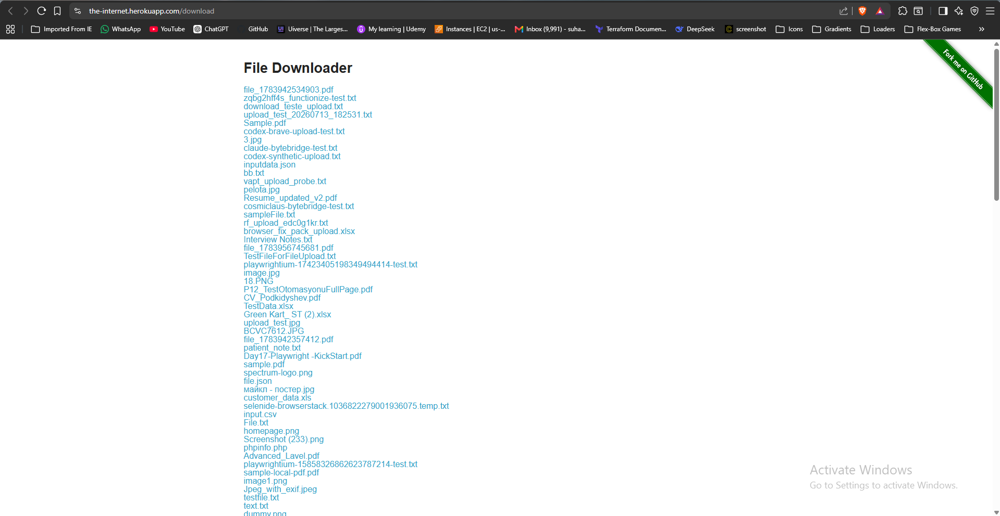
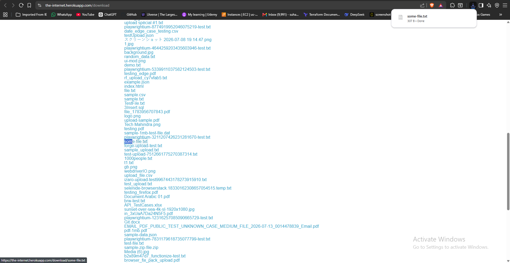
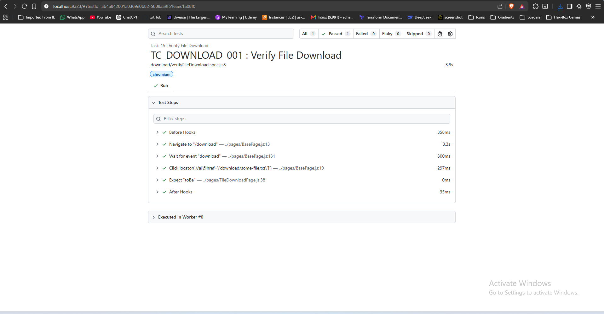

# 🚀 Task-13: Verify File Download | Playwright JavaScript Automation

---

# 📖 Project Overview

This task automates the File Download functionality available on **The Internet Herokuapp** using **Playwright with JavaScript**.

The automation verifies that a user can successfully download a file, save it to a local directory, and validate the downloaded filename.

The framework follows industry-standard automation practices including:

- Page Object Model (POM)
- Base Page Architecture
- Reusable Methods
- JSON Test Data
- Constants File
- Playwright Assertions
- ES Modules (Import / Export)

---

# 📋 Test Case Information

| Field | Details |
|-------|---------|
| **Task** | Task-15 |
| **Module** | File Download |
| **Feature** | Download File |
| **Scenario** | Download file and verify downloaded filename |
| **Test Type** | Functional Testing |
| **Execution Type** | Automated |
| **Priority** | High |
| **Severity** | Medium |
| **Automation Tool** | Playwright |
| **Programming Language** | JavaScript |
| **Framework Pattern** | Page Object Model (POM) |
| **Execution Status** | ✅ Passed |

---

# 🎯 Objective

Validate that a file can be downloaded successfully and verify that the downloaded filename matches the selected file.

---

# 🌐 Application Under Test

| Property | Value |
|----------|-------|
| Application | The Internet Herokuapp |
| Module | File Download |
| URL | https://the-internet.herokuapp.com/download |
| Environment | Demo |

---

# 🛠 Technology Stack

| Technology | Version |
|------------|----------|
| Node.js | v22.11.0 |
| Playwright | v1.61.1 |
| JavaScript | ES6 |
| VS Code | IDE |
| Git | Version Control |
| GitHub | Repository Hosting |

---

# 🏗 Framework Enhancement

## Version

**Version 2.9**

### New Reusable Method Added to BasePage

| Method | Purpose |
|---------|---------|
| downloadFile(downloadLocator, savePath) | Downloads a file and saves it to a specified location |

This reusable method can now be used for:

- Invoice Download
- Report Export
- PDF Download
- Excel Download
- CSV Download
- Image Download
- Attachment Download

without rewriting download logic.

---

# 📁 Project Structure

```text
playwright-practice-js
│
├── docs
│   └── task-15
│       ├── README.md
│       └── screenshots
│
├── downloads
│
├── pages
│   └── FileDownloadPage.js
│
├── testData
│   └── fileDownloadData.json
│
├── tests
│   └── download
│       └── verifyFileDownload.spec.js
│
├── utils
│   └── constants.js
│
├── playwright.config.js
│
└── package.json
```

---

# 📌 Preconditions

- Node.js installed
- Playwright installed
- Browser dependencies installed
- Internet connection available
- Downloads folder available inside the project

---

# 📝 Test Steps

1. Launch browser.
2. Navigate to File Download page.
3. Capture the first available filename.
4. Click the first download link.
5. Wait for the download event.
6. Save the downloaded file to the downloads folder.
7. Verify the downloaded filename.

---

# ✅ Expected Result

- File should download successfully.
- File should be saved in the downloads folder.
- Downloaded filename should match the selected filename.

---

# 📌 Postconditions

- File downloaded successfully.
- Download saved locally.
- Browser closed.

---

# ⚙ Automation Approach

- Page Object Model (POM)
- BasePage Architecture
- JSON Test Data
- Constants File
- Reusable Download Method
- Dynamic File Selection
- Playwright Assertions

---

# 🎯 Playwright Concepts Used

- page.waitForEvent("download")
- download.saveAs()
- download.suggestedFilename()
- path.resolve()
- Assertions
- Page Object Model
- BasePage Reusability

---

# 🔄 BasePage Methods Used

| Method | Purpose |
|---------|---------|
| navigate() | Navigate to application |
| click() | Click download link |
| downloadFile() | Download and save file |
| getLocator() | Locate web elements |

---

# ✔ Assertions Used

```javascript
expect(actualFileName).toBe(expectedFileName);
```

---

# ▶ Test Execution

Run complete suite

```bash
npx playwright test
```

Run Task-15

```bash
npx playwright test tests/download/verifyFileDownload.spec.js --headed
```

Generate HTML Report

```bash
npx playwright show-report
```

---

# 🌍 Browser Support

- Chromium
- Firefox
- WebKit

---

# 📊 Test Execution Status

| Browser | Result |
|----------|--------|
| Chromium | ✅ Passed |

---

# 📷 Test Execution Evidence

## Download Page





## Download Completed





## Playwright HTML Report





---

# 🌿 Git Branch

```
feature/task-15-file-download
```

---

# ⚠ Challenges Faced

- Handling Playwright download events.
- Downloading files dynamically.
- Saving downloaded files to a local directory.
- Avoiding strict mode locator violations.
- Understanding JavaScript return statement behavior.

---

# ✅ Solution Implemented

- Used page.waitForEvent("download") before clicking the download link.
- Downloaded the first available file dynamically.
- Saved the downloaded file using download.saveAs().
- Retrieved the downloaded filename using download.suggestedFilename().
- Compared expected and actual filenames using Playwright assertions.

---

# 📚 Learning Outcome

- Learned Playwright File Download handling.
- Understood download event synchronization.
- Learned dynamic file selection.
- Learned how download.saveAs() works.
- Learned how download.suggestedFilename() retrieves the original filename.
- Improved BasePage reusability with a download method.

---

# 💡 Best Practices Followed

- Page Object Model
- BasePage Reusability
- Dynamic Locator Handling
- Clean Code
- Feature Branch Workflow
- Reusable Utility Methods

---

# 📈 Framework Metrics

| Metric | Value |
|--------|-------|
| Test Cases | 1 |
| Assertions | 1 |
| New BasePage Methods | 1 |
| Download Scenarios | 1 |
| JSON Files | 1 |

---

# 🚀 Future Enhancements

- Multiple File Download
- Download Verification using File System
- File Size Validation
- File Type Validation
- Screenshot on Failure
- Allure Report
- GitHub Actions
- Jenkins Integration

---

# 👨‍💻 Author

**Sohel Shaikh**

QA Automation Engineer

---

# 📄 License

This project is created for learning and portfolio purposes.
