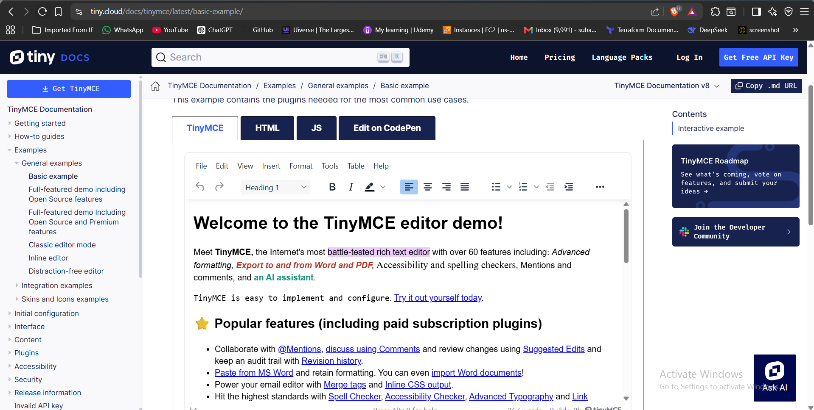
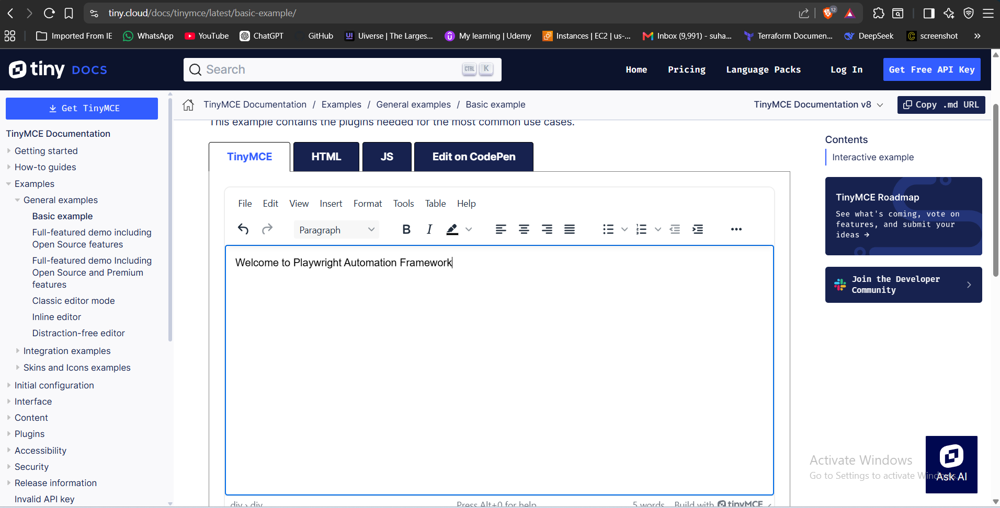
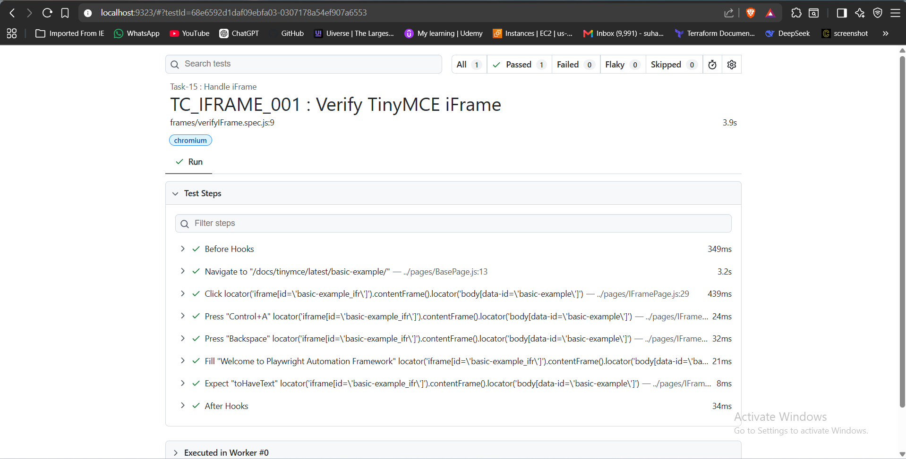

# 🚀 Task-15: Handle iFrame (TinyMCE Editor) | Playwright JavaScript Automation

---

# 📖 Project Overview

This task automates the TinyMCE Rich Text Editor using **Playwright with JavaScript**.

The automation verifies that the framework can successfully interact with an element inside an iFrame by clearing the existing content, entering new text, and validating the updated content.

The framework follows industry-standard automation practices including:

- Page Object Model (POM)
- Base Page Architecture
- Reusable Methods
- JSON Test Data
- Constants File
- Playwright Assertions
- ES Modules (Import / Export)

---

# 📋 Test Case Information

| Field | Details |
|-------|---------|
| **Task** | Task-15 |
| **Module** | iFrame |
| **Feature** | TinyMCE Rich Text Editor |
| **Scenario** | Enter and verify text inside an iFrame |
| **Test Type** | Functional Testing |
| **Execution Type** | Automated |
| **Priority** | High |
| **Severity** | Medium |
| **Automation Tool** | Playwright |
| **Programming Language** | JavaScript |
| **Framework Pattern** | Page Object Model (POM) |
| **Execution Status** | ✅ Passed |

---

# 🎯 Objective

Validate that the automation framework can successfully interact with elements inside an iFrame by clearing the existing content, entering new text, and verifying the updated content.

---

# 🌐 Application Under Test

| Property | Value |
|----------|-------|
| Application | TinyMCE Documentation |
| Module | Rich Text Editor |
| URL | https://www.tiny.cloud/docs/tinymce/latest/basic-example/ |
| Environment | Demo |

---

# 🛠 Technology Stack

| Technology | Version |
|------------|----------|
| Node.js | v22.11.0 |
| Playwright | v1.61.1 |
| JavaScript | ES6 |
| VS Code | IDE |
| Git | Version Control |
| GitHub | Repository Hosting |

---

# 🏗 Framework Enhancement

## Version

**Version 3.1**

### New Reusable Method Added

| Method | Purpose |
|---------|---------|
| getFrame(frameLocator) | Returns a reusable FrameLocator object |

### Benefits

This method can now be reused for:

- TinyMCE Editors
- Payment Frames
- Embedded Reports
- Chat Widgets
- Embedded Applications
- Third-party Forms

without writing frame handling logic again.

---

# 📁 Project Structure

```text
playwright-practice-js
│
├── docs
│   └── task-15
│       ├── README.md
│       └── screenshots
│
├── pages
│   └── IFramePage.js
│
├── testData
│   └── iframeData.json
│
├── tests
│   └── frames
│       └── verifyIFrame.spec.js
│
├── utils
│   └── constants.js
│
└── package.json
```

---

# 📌 Test Data

### iframeData.json

```json
{
    "text": "Welcome to Playwright Automation Framework"
}
```

---

# 📌 Preconditions

- Node.js installed
- Playwright installed
- Browser dependencies installed
- Internet connection available

---

# 📝 Test Steps

1. Launch browser.
2. Navigate to TinyMCE Editor page.
3. Locate the editor iFrame.
4. Switch to the iFrame using `frameLocator()`.
5. Clear the existing editor content.
6. Enter new text.
7. Verify the entered text.

---

# ✅ Expected Result

- iFrame should be accessed successfully.
- Existing text should be cleared.
- New text should be entered.
- Entered text should match the expected value.

---

# 📌 Postconditions

- Text successfully updated.
- Validation completed.
- Browser closed.

---

# ⚙ Automation Approach

- Page Object Model (POM)
- BasePage Architecture
- JSON Test Data
- Constants File
- Reusable Frame Method
- Playwright Assertions

---

# 🎯 Playwright Concepts Used

- frameLocator()
- locator()
- click()
- press()
- fill()
- toHaveText()

---

# 🔄 BasePage Methods Used

| Method | Purpose |
|---------|---------|
| navigate() | Navigate to application |
| getFrame() | Access iFrame |
| click() | Click editor |
| fill() | Enter text |

---

# ✔ Assertions Used

```javascript
await expect(frame.locator("body"))
    .toHaveText(expectedText);
```

---

# ▶ Test Execution

Run complete suite

```bash
npx playwright test
```

Run Task-15

```bash
npx playwright test tests/frames/verifyIFrame.spec.js --headed
```

Generate HTML Report

```bash
npx playwright show-report
```

---

# 🌍 Browser Support

- Chromium
- Firefox
- WebKit

---

# 📊 Test Execution Status

| Browser | Result |
|----------|--------|
| Chromium | ✅ Passed |

---

# 📷 Test Execution Evidence

## TinyMCE Editor





## Updated Editor Content





## Playwright HTML Report





---

# 🌿 Git Branch

```
feature/task-15-handle-iframe
```

---

# ⚠ Challenges Faced

- Understanding Playwright iFrame handling.
- Learning the difference between `frameLocator()` and `frame()`.
- Handling async vs synchronous reusable methods.
- Clearing existing editor content before entering new text.

---

# ✅ Solution Implemented

- Used `frameLocator()` to access the TinyMCE editor.
- Added reusable `getFrame()` method to BasePage.
- Cleared the editor content.
- Entered new text.
- Verified the updated content using Playwright assertions.

---

# 📚 Learning Outcome

- Learned iFrame handling in Playwright.
- Understood `frameLocator()`.
- Learned reusable frame methods.
- Improved BasePage architecture.
- Worked with a real-world Rich Text Editor.

---

# 💡 Best Practices Followed

- Page Object Model
- BasePage Reusability
- JSON Test Data
- Clean Code
- Modular Framework Design
- Feature Branch Workflow

---

# 📈 Framework Metrics

| Metric | Value |
|--------|-------|
| Test Cases | 1 |
| Assertions | 1 |
| New BasePage Methods | 1 |
| iFrames Handled | 1 |
| JSON Files | 1 |

---

# 🚀 Future Enhancements

- Nested iFrames
- Multiple iFrames
- Rich Text Formatting
- Screenshot on Failure
- Allure Report
- GitHub Actions
- Jenkins Integration

---

# 👨‍💻 Author

**Sohel Shaikh**

QA Automation Engineer

---

# 📄 License

This project is created for learning and portfolio purposes.
