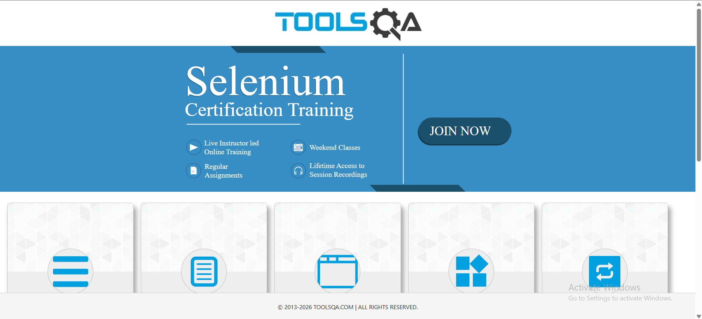
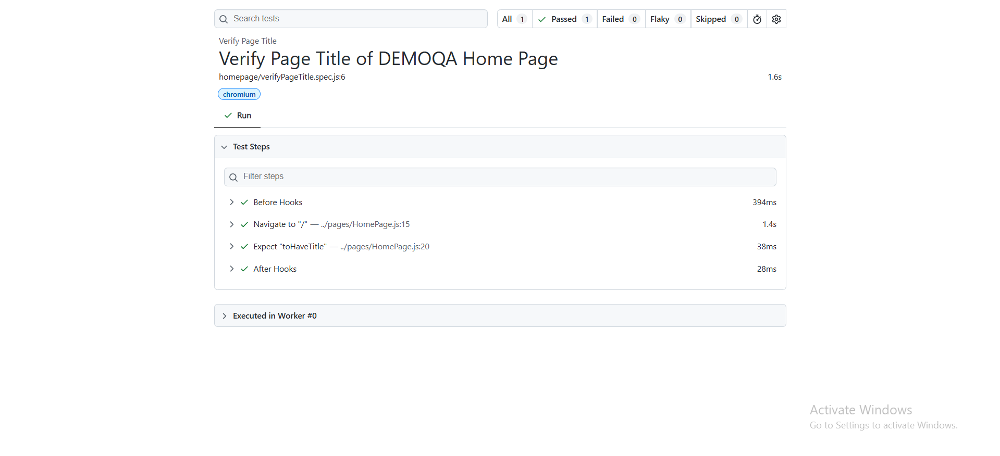

# 🚀 Task-03: Verify DemoQA Page Title | Playwright JavaScript Automation

## 📖 Project Overview

This task automates the **Page Title Verification** functionality of the DemoQA web application using **Playwright with JavaScript**.

The objective is to verify that the application loads successfully and displays the correct browser page title.

The implementation follows industry-standard automation practices including:

- Page Object Model (POM)
- Reusable Page Objects
- Constants File
- Clean Project Structure
- Playwright Assertions

---

# 📋 Test Case Information

| Field | Details |
|-------|---------|
| **Test Case ID** | TC_TITLE_001 |
| **Module** | Home Page |
| **Feature** | Page Title |
| **Scenario** | Verify Page Title |
| **Test Type** | Functional Testing |
| **Execution Type** | Automated |
| **Priority** | High |
| **Severity** | Medium |
| **Automation Tool** | Playwright |
| **Programming Language** | JavaScript |
| **Framework Pattern** | Page Object Model (POM) |
| **Execution Status** | ✅ Passed |

---

# 🎯 Objective

To verify that the DemoQA application launches successfully and displays the correct browser page title.

---

# 🌐 Application Under Test

| Application | Value |
|------------|-------|
| Application Name | DemoQA |
| URL | https://demoqa.com |
| Environment | Demo |

---

# 🛠 Technology Stack

| Technology | Version |
|------------|----------|
| Node.js | Latest |
| Playwright | Latest |
| JavaScript | ES6 |
| VS Code | IDE |
| Git | Version Control |
| GitHub | Repository Hosting |

---

# 📁 Project Structure

```text
playwright-practice-js
│
├── pages
│   └── HomePage.js
│
├── tests
│   └── homepage
│       └── verifyPageTitle.spec.js
│
├── utils
│   └── constants.js
│
├── playwright.config.js
│
├── package.json
│
└── README.md
```

---

# 📌 Preconditions

- Node.js is installed.
- Playwright is installed.
- Browser dependencies are installed.
- Internet connection is available.
- DemoQA application is accessible.

---

# 📝 Test Steps

| Step | Action | Expected Result |
|------|--------|----------------|
| 1 | Launch DemoQA application | Home page should open |
| 2 | Capture browser page title | Page title should be retrieved |
| 3 | Validate page title | Title should match expected value |

---

# ✅ Expected Result

- DemoQA home page should open successfully.
- Browser page title should be:

```text
demosite
```

---

# 📌 Postconditions

- DemoQA home page remains open.
- Page title is successfully verified.

---

# ⚙ Automation Approach

This scenario is automated using:

- Page Object Model (POM)
- Reusable Methods
- Constants File
- Playwright Built-in Assertions
- Async/Await Programming

---

# 🎯 Playwright Concepts Used

- Page Object Model
- Browser Navigation
- Assertions
- Constants File
- Page Title Validation
- Async / Await

---

# ✔ Assertions Used

- Verify browser page title using `expect().toHaveTitle()`

---

# ▶️ Test Execution

Run all tests

```bash
npx playwright test
```

Run only Task-03

```bash
npx playwright test tests/homepage/verifyPageTitle.spec.js --headed
```

Run on Chromium

```bash
npx playwright test tests/homepage/verifyPageTitle.spec.js --project=chromium
```

Generate HTML Report

```bash
npx playwright show-report
```

---

# 🌍 Browser Support

- ✅ Chromium
- ✅ Firefox
- ✅ WebKit

---

# 📊 Test Execution Status

| Execution Date | Browser | Result |
|---------------|----------|--------|
| 03-06-2026 | Chromium | ✅ Passed |

---

# 📷 Test Execution Evidence

## DemoQA Home Page


---

# 📈 Playwright HTML Report


---

# 🌿 Git Branch Information

| Branch |
|---------|
| feature/task-03-verify-page-title |

Commit Message

```text
Task-03: Verify DemoQA page title using Playwright JavaScript
```

---

# ⚠ Challenges Faced

- Creating a reusable Page Object for DemoQA.
- Managing application URLs using a constants file.
- Validating browser page title using Playwright assertions.
- Maintaining a clean and scalable project structure.

---

# 📚 Learning Outcome

- Implemented Page Title verification.
- Improved Page Object Model implementation.
- Used reusable constants for URL management.
- Practiced Playwright title assertions.
- Enhanced framework organization.

---

# 🚀 Future Enhancements

- Cross Browser Execution
- Data-Driven Testing
- Retry Mechanism
- Parallel Execution
- Screenshot on Failure
- Allure Reporting
- GitHub Actions CI/CD
- Docker Integration

---

# 💡 Best Practices Followed

- ✔ Page Object Model (POM)
- ✔ Reusable Methods
- ✔ Constants File
- ✔ Clean Folder Structure
- ✔ Meaningful Naming Convention
- ✔ Version Control using Git
- ✔ Feature Branch Workflow
- ✔ Readable Test Cases

---

# 👨‍💻 Author

**Sohel Shaikh**

QA Automation Engineer

### GitHub Profile

https://github.com/Sohel9147

### Repository

https://github.com/Sohel9147/playwright-javascript-automation-framework

---

# 📄 License

This project is created for learning, practice, and portfolio purposes.
