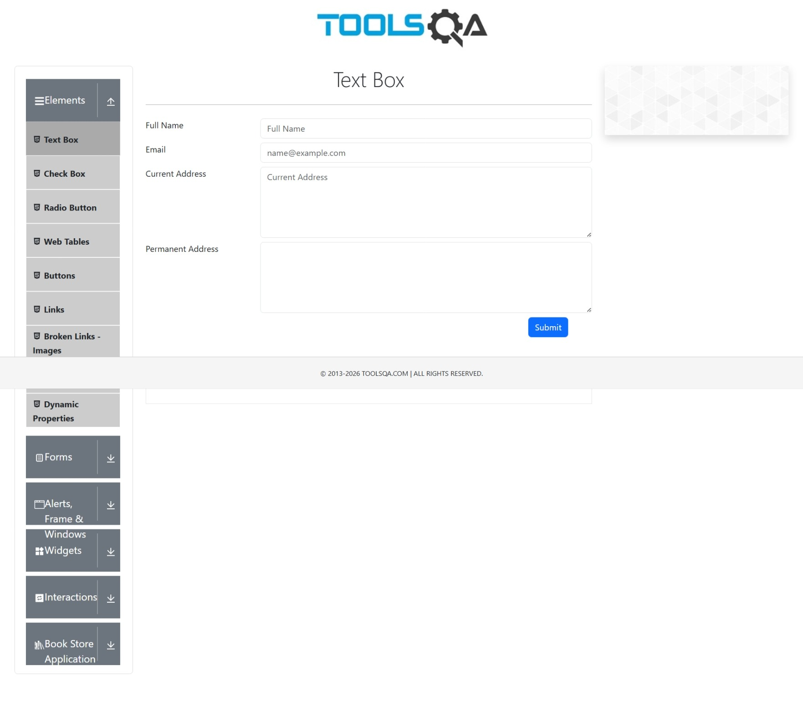
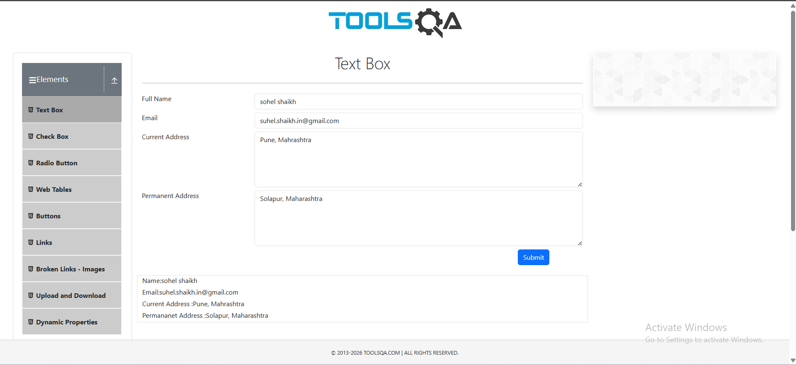
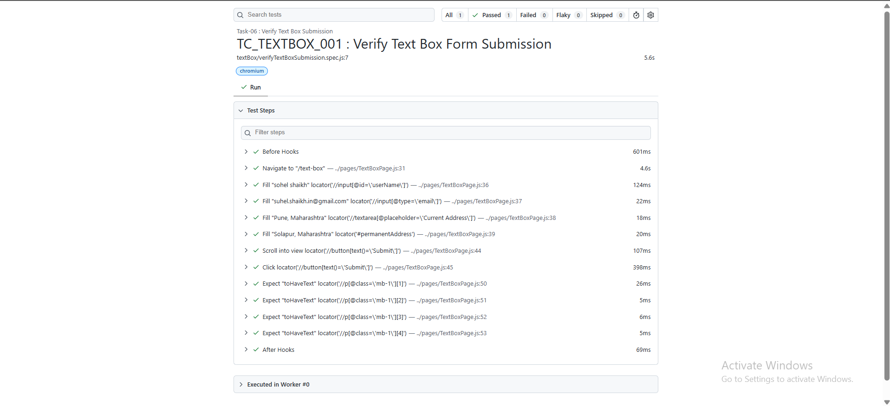

# 🚀 Task-06: Verify Text Box Submission | Playwright JavaScript Automation

## 📖 Project Overview

This task automates the **Text Box Submission** functionality of the DemoQA web application using **Playwright with JavaScript**.

The objective is to verify that a user can successfully enter data into all text fields, submit the form, and validate that the submitted information is displayed correctly.

The implementation follows industry-standard automation practices including:

- Page Object Model (POM)
- Reusable Page Objects
- JSON Test Data
- Constants File
- Clean Project Structure
- Playwright Assertions

---

# 📋 Test Case Information

| Field | Details |
|-------|---------|
| **Test Case ID** | TC_TEXTBOX_001 |
| **Module** | Elements |
| **Feature** | Text Box |
| **Scenario** | Verify Text Box Submission |
| **Test Type** | Functional Testing |
| **Execution Type** | Automated |
| **Priority** | High |
| **Severity** | Medium |
| **Automation Tool** | Playwright |
| **Programming Language** | JavaScript |
| **Framework Pattern** | Page Object Model (POM) |
| **Execution Status** | ✅ Passed |

---

# 🎯 Objective

Verify that the DemoQA Text Box form accepts valid user information and correctly displays the submitted details after clicking the **Submit** button.

---

# 🌐 Application Under Test

| Application | Value |
|------------|-------|
| Application Name | DemoQA |
| URL | https://demoqa.com/text-box |
| Environment | Demo |

---

# 🛠 Technology Stack

| Technology | Version |
|------------|----------|
| Node.js | Latest |
| Playwright | Latest |
| JavaScript | ES6 |
| VS Code | IDE |
| Git | Version Control |
| GitHub | Repository Hosting |

---

# 📁 Project Structure

```text
playwright-practice-js
│
├── pages
│   └── TextBoxPage.js
│
├── tests
│   └── textBox
│       └── verifyTextBoxSubmission.spec.js
│
├── testData
│   └── textBoxData.json
│
├── utils
│   └── constants.js
│
├── playwright.config.js
│
├── package.json
│
└── README.md
```

---

# 📌 Test Data

| Field | Value |
|------|-------|
| Full Name | Sohel Shaikh |
| Email | sohelshaikh@gmail.com |
| Current Address | Pune, Maharashtra |
| Permanent Address | Mumbai, Maharashtra |

---

# 📌 Preconditions

- Node.js is installed.
- Playwright framework is installed.
- Browser dependencies are installed.
- Internet connection is available.
- DemoQA application is accessible.

---

# 📝 Test Steps

| Step | Action | Expected Result |
|------|--------|----------------|
| 1 | Launch DemoQA Text Box page | Page should open successfully |
| 2 | Enter Full Name | Value should be accepted |
| 3 | Enter Email | Value should be accepted |
| 4 | Enter Current Address | Value should be accepted |
| 5 | Enter Permanent Address | Value should be accepted |
| 6 | Click Submit | Form should be submitted |
| 7 | Validate submitted information | Entered values should be displayed |

---

# ✅ Expected Result

- Text Box form should be submitted successfully.
- Submitted values should exactly match the entered values.

---

# 📌 Postconditions

- Submitted information is displayed successfully.
- All entered values are validated.

---

# ⚙ Automation Approach

This scenario is automated using:

- Page Object Model (POM)
- JSON Test Data
- Reusable Methods
- Constants File
- Playwright Built-in Assertions
- Async/Await Programming

---

# 🎯 Playwright Concepts Used

- Page Object Model (POM)
- Playwright Locators
- Fill()
- Click()
- Assertions
- JSON Data Handling
- Browser Navigation
- Async / Await

---

# ✔ Assertions Used

- Verify Full Name
- Verify Email
- Verify Current Address
- Verify Permanent Address

using Playwright `expect().toContainText()`

---

# ▶️ Test Execution

Run all tests

```bash
npx playwright test
```

Run only Task-06

```bash
npx playwright test tests/textBox/verifyTextBoxSubmission.spec.js --headed
```

Generate HTML Report

```bash
npx playwright show-report
```

---

# 🌍 Browser Support

- ✅ Chromium
- ✅ Firefox
- ✅ WebKit

---

# 📊 Test Execution Status

| Execution Date | Browser | Result |
|---------------|----------|--------|
| 09-07-2026 | Chromium | ✅ Passed |

---

# 📷 Test Execution Evidence

## DemoQA Text Box Page



---

## Submitted Form Details



---

# 📈 Playwright HTML Report



---

# 🌿 Git Branch Information

| Branch |
|---------|
| feature/task-06-verify-text-box-submission |

Commit Message

```text
Task-06: Verify Text Box Submission using Playwright JavaScript
```

---

# ⚠ Challenges Faced

- Handling multiple text input fields.
- Scrolling to the Submit button before clicking.
- Managing reusable test data using JSON.
- Validating multiple output values after form submission.

---

# 📚 Learning Outcome

- Implemented Text Box automation using Playwright.
- Practiced JSON-driven test data.
- Improved Page Object Model implementation.
- Strengthened Playwright assertions.
- Enhanced reusable framework design.

---

# 🚀 Future Enhancements

- Data-Driven Testing with Excel
- Cross Browser Execution
- Parallel Execution
- Retry Mechanism
- Screenshot on Failure
- Allure Reporting
- GitHub Actions CI/CD
- Jenkins Integration

---

# 💡 Best Practices Followed

- ✔ Page Object Model (POM)
- ✔ JSON Test Data
- ✔ Reusable Methods
- ✔ Constants File
- ✔ Clean Folder Structure
- ✔ Meaningful Naming Convention
- ✔ Git Feature Branch Workflow
- ✔ Professional Documentation

---

# 👨‍💻 Author

**Sohel Shaikh**

QA Automation Engineer

### GitHub Profile

https://github.com/Sohel9147

### Repository

https://github.com/Sohel9147/playwright-javascript-automation-framework

---

# 📄 License

This project is created for learning, practice, and portfolio purposes.
