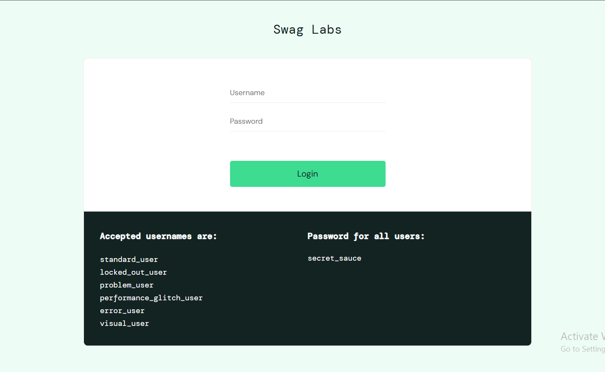
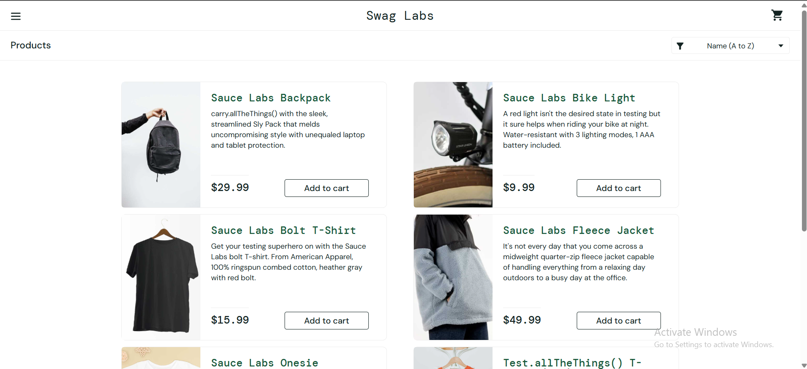
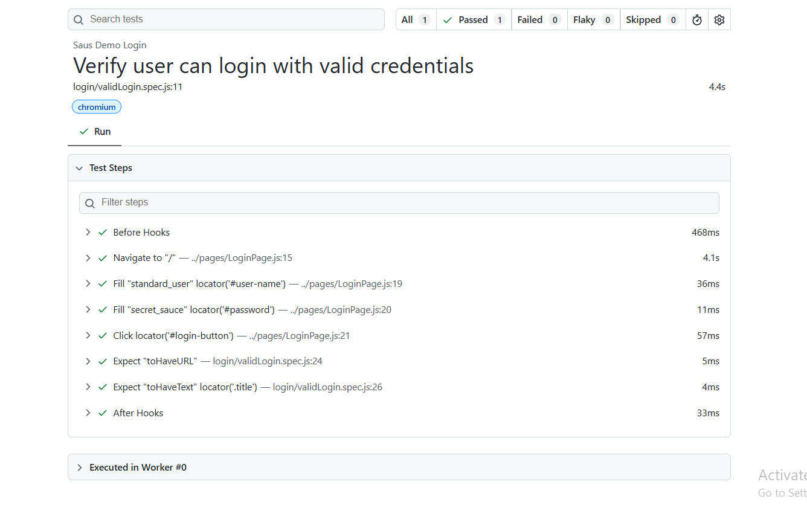

# 🚀 Task-01: Valid Login Scenario | Playwright JavaScript Automation

## 📖 Project Overview

This task automates the **Valid Login** functionality of the SauceDemo web application using **Playwright with JavaScript**.

The objective is to verify that a registered user can successfully log in with valid credentials and is redirected to the Inventory page.

This implementation follows industry-standard automation practices including:
- Page Object Model (POM)
- External Test Data (JSON)
- Reusable Page Objects
- Clean Project Structure
- Playwright Assertions

---

# 📋 Test Case Information

| Field | Details |
|-------|---------|
| **Test Case ID** | TC_LOGIN_001 |
| **Module** | Authentication |
| **Feature** | Login |
| **Scenario** | Valid Login |
| **Test Type** | Functional Testing |
| **Execution Type** | Automated |
| **Priority** | High |
| **Severity** | Critical |
| **Automation Tool** | Playwright |
| **Programming Language** | JavaScript |
| **Framework Pattern** | Page Object Model (POM) |
| **Execution Status** | ✅ Passed |

---

# 🎯 Objective

To verify that a registered user can successfully log in to the SauceDemo application using valid credentials.

---

# 🌐 Application Under Test

| Application | Value |
|------------|-------|
| Application Name | SauceDemo |
| URL | https://www.saucedemo.com |
| Environment | Demo |

---

# 🛠 Technology Stack

| Technology | Version |
|------------|----------|
| Node.js | Latest |
| Playwright | Latest |
| JavaScript | ES6 |
| VS Code | IDE |
| Git | Version Control |
| GitHub | Repository Hosting |

---

# 📁 Project Structure

```text
playwright-practice-js
│
├── pages
│   └── LoginPage.js
│
├── tests
│   └── login
│       └── validLogin.spec.js
│
├── testData
│   └── loginData.json
│
├── utils
│
├── playwright.config.js
│
├── package.json
│
└── README.md
```

---

# 📌 Preconditions

- Node.js is installed.
- Playwright is installed.
- Browser dependencies are installed.
- User has internet connectivity.
- SauceDemo website is accessible.
- Valid login credentials are available.

---

# 🧪 Test Data

| Username | Password |
|----------|----------|
| standard_user | secret_sauce |

---

# 📝 Test Steps

| Step | Action | Expected Result |
|------|--------|----------------|
| 1 | Launch SauceDemo application | Login page should open |
| 2 | Enter valid username | Username should be entered successfully |
| 3 | Enter valid password | Password should be entered successfully |
| 4 | Click Login button | User should be authenticated |
| 5 | Verify Inventory page | Products page should be displayed |

---

# ✅ Expected Result

- Login should be successful.
- Inventory page should be displayed.
- URL should contain **inventory.html**.
- Products title should be visible.

---

# 📌 Postconditions

- User is logged in successfully.
- Inventory page is displayed.
- Application is ready for the next user actions such as Add to Cart or Checkout.

---

# ⚙ Automation Approach

This scenario is automated using:

- Page Object Model (POM)
- External JSON Test Data
- Reusable Methods
- Playwright Built-in Assertions
- Async/Await Programming

---

# 🎯 Playwright Concepts Used

- Page Object Model
- Locators
- Assertions
- Async / Await
- JSON Test Data
- Browser Context
- Playwright Test Runner

---

# ✔ Assertions Used

- Verify URL
- Verify Products Page Title

---

# ▶️ Test Execution

Run all tests

```bash
npx playwright test
```

Run only Task-01

```bash
npx playwright test tests/login/validLogin.spec.js --headed
```

Run on Chromium

```bash
npx playwright test tests/login/validLogin.spec.js --project=chromium
```

Generate HTML Report

```bash
npx playwright show-report
```

---

# 🌍 Browser Support

- ✅ Chromium
- ✅ Firefox
- ✅ WebKit

---

# 📊 Test Execution Status

| Execution Date | Browser | Result |
|---------------|----------|--------|
| 02-06-2026 | Chromium | ✅ Passed |

---

# 📷 Execution Evidence

## Login Page


---

## Successful Login



---

# 📈 Playwright HTML Report



---

# 🌿 Git Branch Information

| Branch |
|---------|
| feature/task-01-valid-login |

Commit Message

```text
Task-01: Implement valid login scenario using Playwright JavaScript
```

---

# ⚠ Challenges Faced

- Understanding Playwright project structure.
- Implementing the Page Object Model.
- Managing external JSON test data.
- Learning Playwright assertions.

---

# 📚 Learning Outcome

- Learned Playwright project setup.
- Implemented Page Object Model.
- Used reusable page methods.
- Performed UI validations using assertions.
- Executed Playwright tests from terminal.
- Generated Playwright HTML reports.
- Managed code using Git feature branches.

---

# 🚀 Future Enhancements

- Data Driven Testing
- Environment Configuration
- Cross Browser Execution
- Parallel Test Execution
- Allure Reporting
- CI/CD using GitHub Actions
- Docker Integration
- API Testing using Playwright

---

# 👨‍💻 Author

**Suhel Shaikh**

QA Automation Engineer

GitHub Profile:
https://github.com/Sohel9147

Repository:
https://github.com/Sohel9147/playwright-javascript-automation-framework

---

# 📄 License

This project is created for learning, practice, and portfolio purposes.
