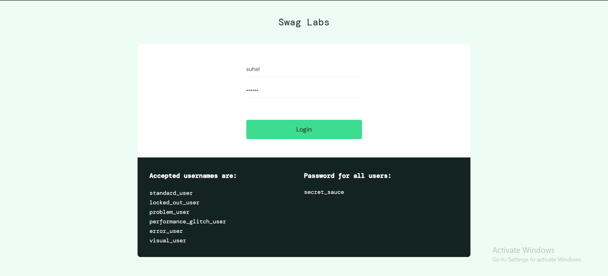
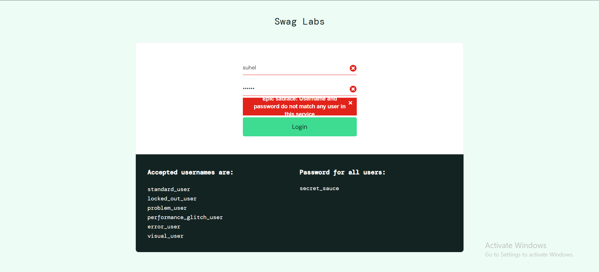
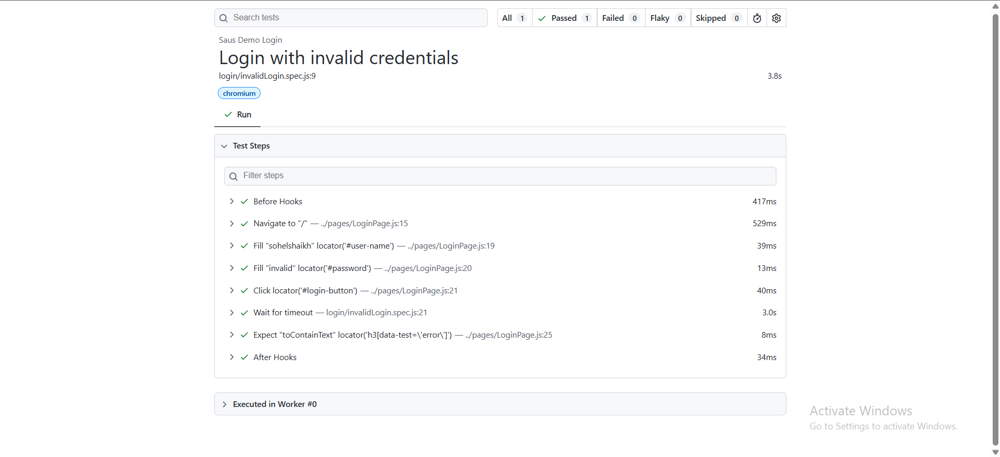

# 🚀 Task-02: Invalid Login Scenario | Playwright JavaScript Automation

## 📖 Project Overview

This task automates the **Invalid Login** functionality of the SauceDemo web application using **Playwright with JavaScript**.

The objective is to verify that the application displays an appropriate error message when a user attempts to log in using invalid credentials.

The implementation follows industry-standard automation practices including:
- Page Object Model (POM)
- External Test Data (JSON)
- Reusable Page Objects
- Clean Project Structure
- Playwright Assertions

---

# 📋 Test Case Information

| Field | Details |
|-------|---------|
| **Test Case ID** | TC_LOGIN_002 |
| **Module** | Authentication |
| **Feature** | Login |
| **Scenario** | Invalid Login |
| **Test Type** | Negative Testing |
| **Execution Type** | Automated |
| **Priority** | High |
| **Severity** | Critical |
| **Automation Tool** | Playwright |
| **Programming Language** | JavaScript |
| **Framework Pattern** | Page Object Model (POM) |
| **Execution Status** | ✅ Passed |

---

# 🎯 Objective

To verify that the application prevents users from logging in with invalid credentials and displays the appropriate validation message.

---

# 🌐 Application Under Test

| Application | Value |
|------------|-------|
| Application Name | SauceDemo |
| URL | https://www.saucedemo.com |
| Environment | Demo |

---

# 🛠 Technology Stack

| Technology | Version |
|------------|----------|
| Node.js | Latest |
| Playwright | Latest |
| JavaScript | ES6 |
| VS Code | IDE |
| Git | Version Control |
| GitHub | Repository Hosting |

---

# 📁 Project Structure

```text
playwright-practice-js
│
├── pages
│   └── LoginPage.js
│
├── tests
│   └── login
│       └── invalidLogin.spec.js
│
├── testData
│   └── invalidLoginData.json
│
├── utils
│   └── constants.js
│
├── playwright.config.js
│
├── package.json
│
└── README.md
```

---

# 📌 Preconditions

- Node.js is installed.
- Playwright is installed.
- Browser dependencies are installed.
- Internet connection is available.
- SauceDemo application is accessible.

---

# 🧪 Test Data

| Username | Password |
|----------|----------|
| invalid_user | invalid_password |

---

# 📝 Test Steps

| Step | Action | Expected Result |
|------|--------|----------------|
| 1 | Launch SauceDemo application | Login page should open |
| 2 | Enter invalid username | Username should be entered |
| 3 | Enter invalid password | Password should be entered |
| 4 | Click Login button | Login attempt should fail |
| 5 | Verify error message | Appropriate validation message should be displayed |

---

# ✅ Expected Result

- User should not be logged in.
- User should remain on the Login page.
- Error message should be displayed.
- Inventory page should not be accessible.

---

# ❌ Expected Error Message

```text
Epic sadface: Username and password do not match any user in this service
```

---

# 📌 Postconditions

- User remains on the Login page.
- No authenticated session is created.
- Application prevents unauthorized access.

---

# ⚙ Automation Approach

This scenario is automated using:

- Page Object Model (POM)
- External JSON Test Data
- Reusable Methods
- Playwright Built-in Assertions
- Async/Await Programming

---

# 🎯 Playwright Concepts Used

- Page Object Model
- Locators
- Assertions
- JSON Test Data
- Negative Testing
- Async / Await
- Browser Context

---

# ✔ Assertions Used

- Verify error message
- Verify user remains on Login page

---

# ▶️ Test Execution

Run all tests

```bash
npx playwright test
```

Run only Task-02

```bash
npx playwright test tests/login/invalidLogin.spec.js --headed
```

Run on Chromium

```bash
npx playwright test tests/login/invalidLogin.spec.js --project=chromium
```

Generate HTML Report

```bash
npx playwright show-report
```

---

# 🌍 Browser Support

- ✅ Chromium
- ✅ Firefox
- ✅ WebKit

---

# 📊 Test Execution Status

| Execution Date | Browser | Result |
|---------------|----------|--------|
| 02-06-2026 | Chromium | ✅ Passed |

---

# 📷 Test Execution Evidence

## Invalid Login Page


---

## Error Message Validation


---

# 📈 Playwright HTML Report


---

# 🌿 Git Branch Information

| Branch |
|---------|
| feature/task-02-invalid-login |

Commit Message

```text
Task-02: Implement invalid login scenario using Playwright JavaScript
```

---

# ⚠ Challenges Faced

- Implementing reusable Page Object methods.
- Reading test data from external JSON files.
- Managing reusable constants.
- Validating error messages using Playwright assertions.
- Maintaining clean project structure.

---

# 📚 Learning Outcome

- Implemented Negative Login automation.
- Improved Page Object Model implementation.
- Used external JSON test data.
- Validated UI error messages.
- Practiced reusable automation design.
- Enhanced Git branching workflow.

---

# 🚀 Future Enhancements

- Data-Driven Testing
- Cross Browser Execution
- Environment Configuration
- Retry Mechanism
- Parallel Execution
- Allure Reporting
- GitHub Actions CI/CD
- Docker Integration

---

# 💡 Best Practices Followed

- ✔ Page Object Model (POM)
- ✔ External Test Data
- ✔ Reusable Methods
- ✔ Clean Folder Structure
- ✔ Meaningful Naming Convention
- ✔ Version Control using Git
- ✔ Feature Branch Workflow
- ✔ Readable Test Cases

---

# 👨‍💻 Author

**Sohel Shaikh**

QA Automation Engineer

GitHub Profile:

https://github.com/Sohel9147

Repository:

https://github.com/Sohel9147/playwright-javascript-automation-framework

---

# 📄 License

This project is created for learning, practice, and portfolio purposes.
