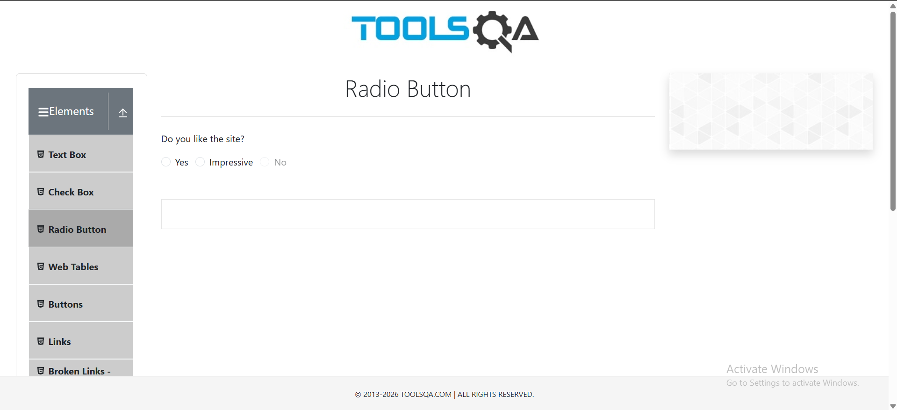
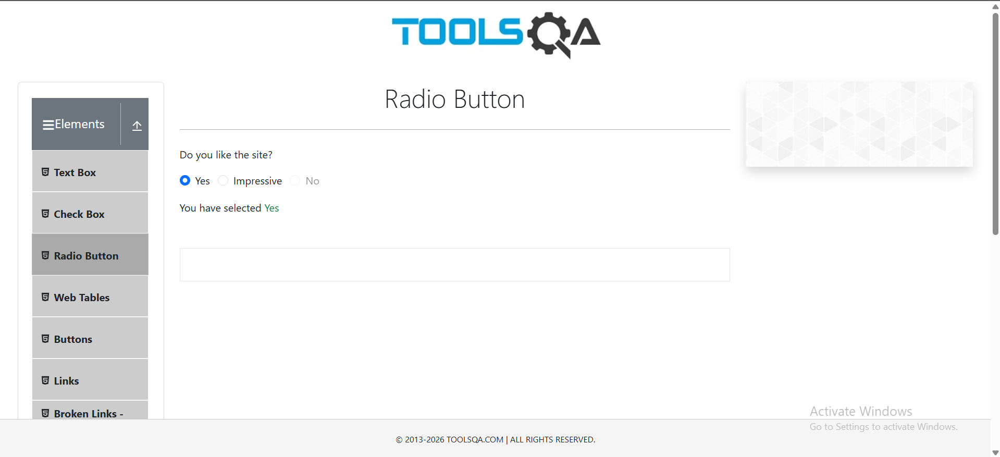
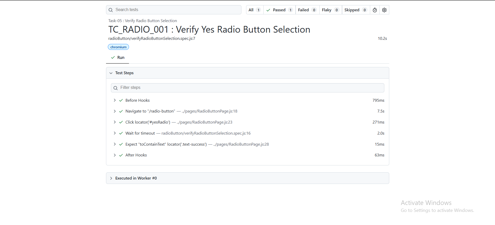

# 🚀 Task-05: Verify Radio Button Selection | Playwright JavaScript Automation

## 📖 Project Overview

This task automates the **Radio Button Selection** functionality of the DemoQA web application using **Playwright with JavaScript**.

The objective is to verify that a user can successfully select the **Yes** radio button and validate the displayed success message.

The implementation follows industry-standard automation practices including:

- Page Object Model (POM)
- Reusable Page Objects
- Constants File
- Clean Project Structure
- Playwright Assertions

---

# 📋 Test Case Information

| Field | Details |
|-------|---------|
| **Test Case ID** | TC_RADIO_001 |
| **Module** | Elements |
| **Feature** | Radio Button |
| **Scenario** | Verify Radio Button Selection |
| **Test Type** | Functional Testing |
| **Execution Type** | Automated |
| **Priority** | High |
| **Severity** | Medium |
| **Automation Tool** | Playwright |
| **Programming Language** | JavaScript |
| **Framework Pattern** | Page Object Model (POM) |
| **Execution Status** | ✅ Passed |

---

# 🎯 Objective

Verify that the **Yes** radio button can be selected successfully and the application displays the correct confirmation message.

---

# 🌐 Application Under Test

| Application | Value |
|------------|-------|
| Application Name | DemoQA |
| URL | https://demoqa.com/radio-button |
| Environment | Demo |

---

# 🛠 Technology Stack

| Technology | Version |
|------------|----------|
| Node.js | Latest |
| Playwright | Latest |
| JavaScript | ES6 |
| VS Code | IDE |
| Git | Version Control |
| GitHub | Repository Hosting |

---

# 📁 Project Structure

```text
playwright-practice-js
│
├── pages
│   └── RadioButtonPage.js
│
├── tests
│   └── radioButton
│       └── verifyRadioButtonSelection.spec.js
│
├── utils
│   └── constants.js
│
├── playwright.config.js
│
├── package.json
│
└── README.md
```

---

# 📌 Preconditions

- Node.js is installed.
- Playwright is installed.
- Browser dependencies are installed.
- Internet connection is available.
- DemoQA application is accessible.

---

# 📝 Test Steps

| Step | Action | Expected Result |
|------|--------|----------------|
| 1 | Launch DemoQA Radio Button page | Radio Button page should open |
| 2 | Select **Yes** radio button | Radio button should be selected |
| 3 | Validate confirmation message | Success message should display **Yes** |

---

# ✅ Expected Result

- DemoQA Radio Button page loads successfully.
- **Yes** radio button is selected.
- Confirmation message displays:

```text
Yes
```

---

# 📌 Postconditions

- Yes radio button remains selected.
- Confirmation message is displayed successfully.

---

# ⚙ Automation Approach

This scenario is automated using:

- Page Object Model (POM)
- Reusable Methods
- Constants File
- Playwright Built-in Assertions
- Async/Await Programming

---

# 🎯 Playwright Concepts Used

- Page Object Model (POM)
- Browser Navigation
- Playwright Locators
- Click Actions
- Assertions
- Auto Waiting
- Async / Await

---

# ✔ Assertions Used

- Verify confirmation message using `expect().toContainText()`

---

# ▶️ Test Execution

Run all tests

```bash
npx playwright test
```

Run only Task-05

```bash
npx playwright test tests/radioButton/verifyRadioButtonSelection.spec.js --headed
```

Generate HTML Report

```bash
npx playwright show-report
```

---

# 🌍 Browser Support

- ✅ Chromium
- ✅ Firefox
- ✅ WebKit

---

# 📊 Test Execution Status

| Execution Date | Browser | Result |
|---------------|----------|--------|
| 03-06-2026 | Chromium | ✅ Passed |

---

# 📷 Test Execution Evidence

## Radio Button Page



---

## Radio Button Selected



---

# 📈 Playwright HTML Report



---

# 🌿 Git Branch Information

| Branch |
|---------|
| feature/task-05-verify-radio-button-selection |

Commit Message

```text
Task-05: Verify Radio Button Selection using Playwright JavaScript
```

---

# ⚠ Challenges Faced

- Identifying reliable locators for radio button elements.
- Validating the confirmation message after radio button selection.
- Implementing reusable page methods using the Page Object Model.
- Maintaining a clean and scalable project structure.

---

# 📚 Learning Outcome

- Implemented radio button automation using Playwright.
- Improved understanding of Playwright locators.
- Strengthened Page Object Model implementation.
- Practiced Playwright assertions.
- Enhanced framework organization following automation best practices.

---

# 🚀 Future Enhancements

- Cross Browser Execution
- Data-Driven Testing
- Parallel Execution
- Retry Mechanism
- Screenshot on Failure
- Allure Reporting
- GitHub Actions CI/CD
- Jenkins Integration

---

# 💡 Best Practices Followed

- ✔ Page Object Model (POM)
- ✔ Reusable Methods
- ✔ Constants File
- ✔ Clean Folder Structure
- ✔ Meaningful Naming Convention
- ✔ Version Control using Git
- ✔ Feature Branch Workflow
- ✔ Professional Documentation

---

# 👨‍💻 Author

**Sohel Shaikh**

QA Automation Engineer

### GitHub Profile

https://github.com/Sohel9147

### Repository

https://github.com/Sohel9147/playwright-javascript-automation-framework

---

# 📄 License

This project is created for learning, practice, and portfolio purposes.
