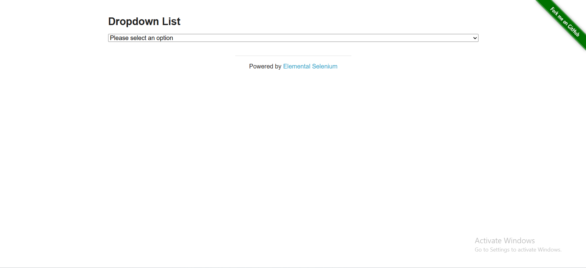
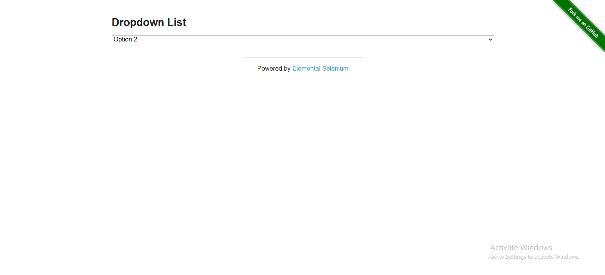
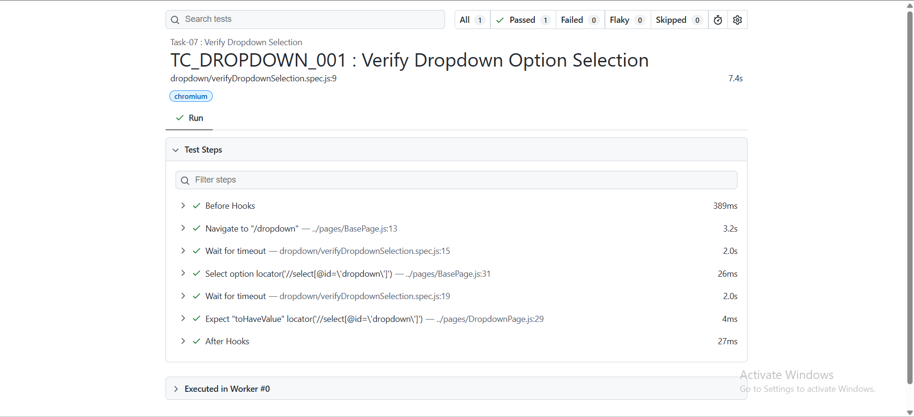

# 🚀 Task-07: Verify Dropdown Selection | Playwright JavaScript Automation

## 📖 Project Overview

This task automates the **Dropdown Selection** functionality of **The Internet Herokuapp** using **Playwright with JavaScript**.

The objective is to verify that a user can successfully select an option from the dropdown and validate that the selected option is correctly displayed.

This task also marks the beginning of the **Framework Version 2.0**, where reusable components such as the **BasePage** are introduced to reduce code duplication and improve framework maintainability.

The implementation follows industry-standard automation practices including:

- Page Object Model (POM)
- Base Page Architecture
- Reusable Methods
- JSON Test Data
- Constants File
- Clean Project Structure
- Playwright Assertions

---

# 📋 Test Case Information

| Field | Details |
|-------|---------|
| **Test Case ID** | TC_DROPDOWN_001 |
| **Module** | Dropdown |
| **Feature** | Verify Dropdown Selection |
| **Scenario** | Select and Validate Dropdown Option |
| **Test Type** | Functional Testing |
| **Execution Type** | Automated |
| **Priority** | High |
| **Severity** | Medium |
| **Automation Tool** | Playwright |
| **Programming Language** | JavaScript |
| **Framework Pattern** | Page Object Model (POM) + Base Page |
| **Execution Status** | ✅ Passed |

---

# 🎯 Objective

Verify that a user can successfully select an option from the dropdown and validate that the selected value matches the expected value.

---

# 🌐 Application Under Test

| Application | Value |
|------------|-------|
| Application Name | The Internet Herokuapp |
| URL | https://the-internet.herokuapp.com/dropdown |
| Environment | Demo |

---

# 🛠 Technology Stack

| Technology | Version |
|------------|----------|
| Node.js | v22.11.0 |
| Playwright | v1.61.1 |
| JavaScript | ES6 |
| VS Code | IDE |
| Git | Version Control |
| GitHub | Repository Hosting |

---

# 📁 Project Structure

```text
playwright-practice-js
│
├── pages
│   ├── BasePage.js
│   └── DropdownPage.js
│
├── tests
│   └── dropdown
│       └── verifyDropdownSelection.spec.js
│
├── testData
│   └── dropdownData.json
│
├── utils
│   └── constants.js
│
├── playwright.config.js
│
├── package.json
│
└── README.md
```

---

# 📌 Test Data

| Field | Value |
|------|-------|
| Dropdown Option | Option 1 |
| Selected Value | 1 |

---

# 📌 Preconditions

- Node.js is installed.
- Playwright framework is installed.
- Browser dependencies are installed.
- Internet connection is available.
- The Internet Herokuapp is accessible.

---

# 📝 Test Steps

| Step | Action | Expected Result |
|------|--------|----------------|
| 1 | Launch Dropdown page | Page should open successfully |
| 2 | Locate dropdown | Dropdown should be visible |
| 3 | Select Option 1 | Option should be selected |
| 4 | Validate selected value | Selected value should match expected value |

---

# ✅ Expected Result

- Dropdown option should be selected successfully.
- Selected value should exactly match the expected value.

---

# 📌 Postconditions

- Dropdown selection completed successfully.
- Selected option validated successfully.

---

# ⚙ Automation Approach

This scenario is automated using:

- Page Object Model (POM)
- Base Page Architecture
- JSON Test Data
- Reusable Methods
- Constants File
- Playwright Built-in Assertions
- Async/Await Programming

---

# 🎯 Playwright Concepts Used

- Page Object Model (POM)
- Base Page
- Inheritance
- selectOption()
- Playwright Locators
- Assertions
- JSON Test Data
- Async / Await

---

# ✔ Assertions Used

- Verify selected dropdown value

using Playwright

```javascript
await expect(locator).toHaveValue(expectedValue);
```

---

# ▶️ Test Execution

Run all tests

```bash
npx playwright test
```

Run only Task-07

```bash
npx playwright test tests/dropdown/verifyDropdownSelection.spec.js --headed
```

Generate HTML Report

```bash
npx playwright show-report
```

---

# 🌍 Browser Support

- ✅ Chromium
- ✅ Firefox
- ✅ WebKit

---

# 📷 Test Execution Evidence

## Dropdown Page



---

## Successful Dropdown Selection



---

# 📈 Playwright HTML Report



---

# 🌿 Git Branch Information

| Branch |
|---------|
| feature/task-07-dropdown-selection |

Commit Message

```text
Task-07: Verify Dropdown Selection using BasePage and Playwright
```

---

# ⚠ Challenges Faced

- Implementing reusable BasePage methods.
- Handling dropdown selection using Playwright.
- Managing reusable constants.
- Designing framework with inheritance.
- Validating selected dropdown value.

---

# 📚 Learning Outcome

- Introduced BasePage into the framework.
- Learned inheritance using `extends`.
- Implemented reusable methods.
- Improved framework scalability.
- Strengthened Playwright assertions.
- Enhanced Page Object Model implementation.

---

# 🚀 Future Enhancements

- Multiple dropdown validations
- Data-Driven Testing
- Cross Browser Execution
- Parallel Execution
- Retry Mechanism
- Screenshot on Failure
- Allure Reporting
- GitHub Actions CI/CD
- Jenkins Integration

---

# 💡 Best Practices Followed

- ✔ Page Object Model (POM)
- ✔ Base Page Architecture
- ✔ JSON Test Data
- ✔ Reusable Methods
- ✔ Constants File
- ✔ Clean Folder Structure
- ✔ Meaningful Naming Convention
- ✔ Git Feature Branch Workflow
- ✔ Professional Documentation

---

# 👨‍💻 Author

**Sohel Shaikh**

QA Automation Engineer

### GitHub Profile

https://github.com/Sohel9147

### Repository

https://github.com/Sohel9147/playwright-javascript-automation-framework

---

# 📄 License

This project is created for learning, practice, and portfolio purposes.