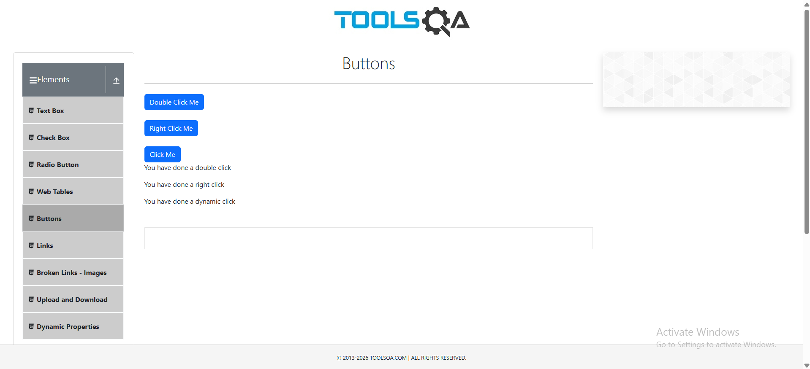
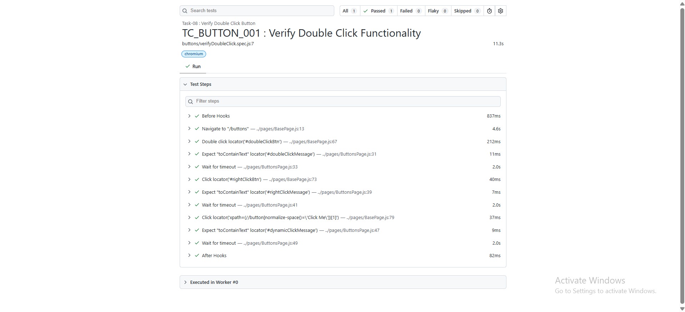

# 🚀 Task-08: Verify Button Click | Playwright JavaScript Automation

## 📖 Project Overview

This task automates the **Buttons** functionality available on the **DemoQA** website using **Playwright with JavaScript**.

The objective is to verify different button actions, with primary focus on the **Double Click** operation and validating the success message displayed after the action.

This task further enhances the automation framework by utilizing the reusable **BasePage** methods introduced in the previous task.

The framework follows industry-standard automation practices including:

- Page Object Model (POM)
- Base Page Architecture
- Reusable Methods
- JSON Test Data
- Constants File
- Playwright Assertions
- ES Modules (Import / Export)

---

# 📋 Test Case Information

| Field | Details |
|-------|---------|
| **Test Case ID** | TC_BUTTON_001 |
| **Module** | Buttons |
| **Feature** | Double Click Button |
| **Scenario** | Verify Double Click Functionality |
| **Test Type** | Functional Testing |
| **Execution Type** | Automated |
| **Priority** | High |
| **Severity** | Medium |
| **Automation Tool** | Playwright |
| **Programming Language** | JavaScript |
| **Framework Pattern** | Page Object Model (POM) + Base Page |
| **Execution Status** | ✅ Passed |

---

# 🎯 Objective

Verify that the Double Click button performs the expected action and displays the correct success message.

---

# 🌐 Application Under Test

| Application | Value |
|------------|-------|
| Application Name | DemoQA |
| Module | Buttons |
| URL | https://demoqa.com/buttons |
| Environment | Demo |

---

# 🛠 Technology Stack

| Technology | Version |
|------------|----------|
| Node.js | v22.11.0 |
| Playwright | v1.61.1 |
| JavaScript | ES6 |
| VS Code | IDE |
| Git | Version Control |
| GitHub | Repository Hosting |

---

# 🏗 Framework Evolution

## Framework Version

**Version 2.1**

### New Enhancements Introduced

- Added reusable `doubleClick()` method in BasePage.
- Added reusable `rightClick()` method.
- Added reusable button interaction methods.
- Continued implementation using ES Modules.
- Improved Page Object readability.

---

# 📁 Project Structure

```text
playwright-practice-js
│
├── docs
│   └── task-08
│       ├── README.md
│       └── screenshots
│
├── pages
│   ├── BasePage.js
│   └── ButtonsPage.js
│
├── testData
│   └── buttonsData.json
│
├── tests
│   └── buttons
│       └── verifyDoubleClick.spec.js
│
├── utils
│   └── constants.js
│
├── playwright.config.js
│
└── package.json
```

---

# 📌 Test Data

```json
{
    "expectedDbClickMessage": "You have done a double click"
}
```

---

# 📌 Preconditions

- Node.js installed.
- Playwright installed.
- Browser dependencies installed.
- DemoQA website accessible.
- Framework configured successfully.

---

# 📝 Test Steps

| Step | Action | Expected Result |
|------|--------|----------------|
| 1 | Launch Browser | Browser opens successfully |
| 2 | Navigate to DemoQA Buttons page | Buttons page loads |
| 3 | Double Click button | Action performed successfully |
| 4 | Validate success message | Correct message displayed |

---

# ✅ Expected Result

The success message should display:

```
You have done a double click
```

---

# 📌 Postconditions

- Button action completed successfully.
- Validation passed.
- Browser closed.

---

# ⚙ Automation Approach

- Page Object Model (POM)
- Base Page Architecture
- JSON Test Data
- Reusable Methods
- Playwright Assertions

---

# 🎯 Playwright Concepts Used

- Page Object Model
- BasePage
- Inheritance
- Double Click
- Assertions
- JSON Data
- ES Modules

---

# 🔄 Reusable Methods Used

| Method | Purpose |
|---------|---------|
| navigate() | Navigate to URL |
| doubleClick() | Double click an element |
| getLocator() | Return Playwright locator |

---

# ✔ Assertions Used

```javascript
await expect(locator).toContainText(expectedMessage);
```

---

# ▶ Test Execution

Run complete suite

```bash
npx playwright test
```

Run Task-08

```bash
npx playwright test tests/buttons/verifyDoubleClick.spec.js --headed
```

Generate HTML Report

```bash
npx playwright show-report
```

---

# 🌍 Browser Support

- Chromium
- Firefox
- WebKit

---

# 📊 Test Execution Status

| Browser | Result |
|----------|--------|
| Chromium | ✅ Passed |

---

# 📷 Test Execution Evidence

## Application Loaded

```
```


---

## Double Click Successful

```
```



---

## Playwright HTML Report

```
```


---

# 🌿 Git Branch

```
feature/task-08-button-double-click
```

---

# ⚠ Challenges Faced

- Creating reusable BasePage methods.
- Understanding Playwright mouse actions.
- Validating dynamic success messages.

---

# ✅ Solution Implemented

- Implemented reusable `doubleClick()` method.
- Used Playwright assertions.
- Followed Page Object Model.
- Externalized test data into JSON.

---

# 📚 Learning Outcome

- Learned Double Click handling.
- Improved BasePage.
- Better understanding of reusable framework components.
- Continued using ES Modules.

---

# 💡 Best Practices Followed

- Page Object Model
- Base Page
- JSON Test Data
- Clean Code
- Feature Branch Workflow
- Professional Folder Structure

---

# 📈 Framework Metrics

| Metric | Value |
|---------|------|
| Test Cases | 1 |
| Page Objects | 1 |
| BasePage Methods Used | 3 |
| Assertions | 1 |
| JSON Files | 1 |

---

# 🚀 Future Enhancements

- Right Click Validation
- Dynamic Click Validation
- Parallel Execution
- Screenshot on Failure
- Allure Report
- GitHub Actions

---

# 👨‍💻 Author

**Sohel Shaikh**

QA Automation Engineer

---

# 📄 License

This project is created for learning and portfolio purposes.