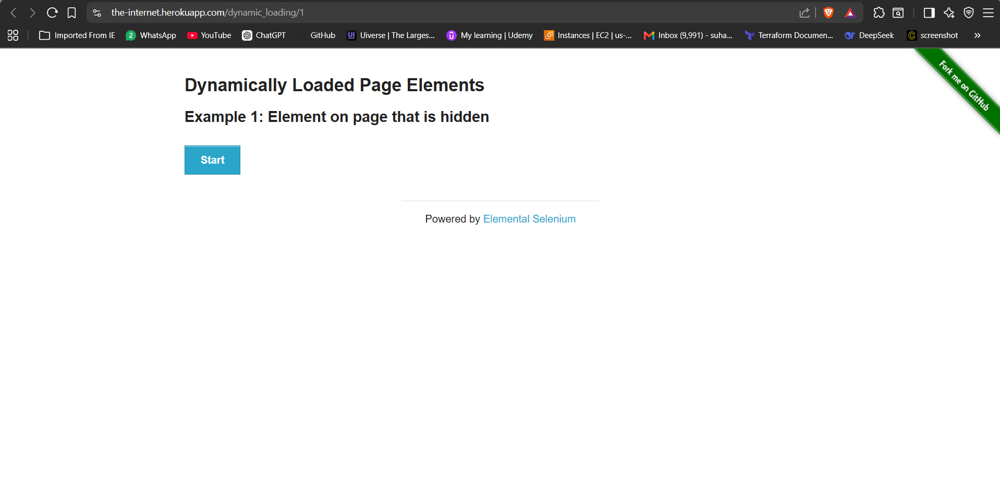
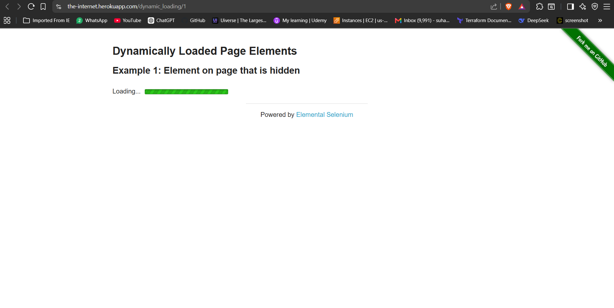
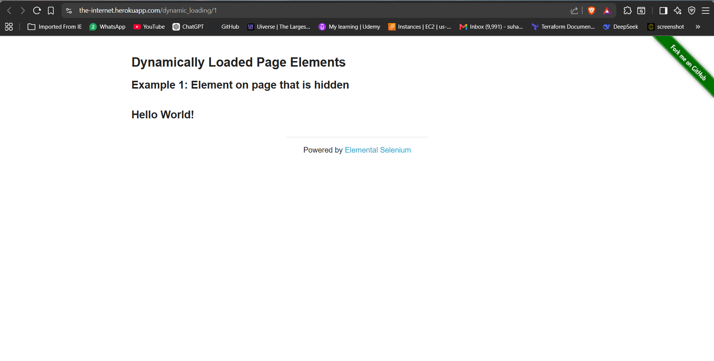
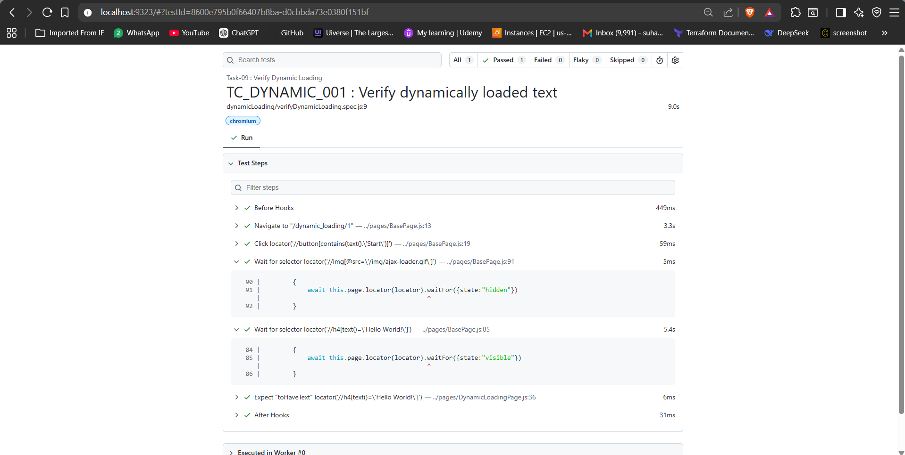

# 🚀 Task-09: Verify Dynamic Loading | Playwright JavaScript Automation

## 📖 Project Overview

This task automates the **Dynamic Loading** functionality available on **The Internet** website using **Playwright with JavaScript**.

The objective is to verify that dynamically loaded content appears successfully after clicking the **Start** button. This task demonstrates handling asynchronous UI elements using Playwright's explicit waiting mechanisms instead of static waits.

The framework follows industry-standard automation practices including:

- Page Object Model (POM)
- Base Page Architecture
- Reusable Methods
- JSON Test Data
- Constants File
- Playwright Assertions
- ES Modules (Import / Export)

---

# 📋 Test Case Information

| Field | Details |
|-------|---------|
| **Test Case ID** | TC_DYNAMIC_001 |
| **Module** | Dynamic Loading |
| **Feature** | Dynamic Text Validation |
| **Scenario** | Verify dynamically loaded text after clicking Start |
| **Test Type** | Functional Testing |
| **Execution Type** | Automated |
| **Priority** | High |
| **Severity** | Medium |
| **Automation Tool** | Playwright |
| **Programming Language** | JavaScript |
| **Framework Pattern** | Page Object Model (POM) + Base Page |
| **Execution Status** | ✅ Passed |

---

# 🎯 Objective

Verify that the dynamically loaded text **"Hello World!"** is displayed after the loading process completes.

---

# 🌐 Application Under Test

| Property | Value |
|----------|-------|
| Application | The Internet |
| Module | Dynamic Loading |
| URL | https://the-internet.herokuapp.com/dynamic_loading/1 |
| Environment | Demo |

---

# 🛠 Technology Stack

| Technology | Version |
|------------|----------|
| Node.js | v22.11.0 |
| Playwright | v1.61.1 |
| JavaScript | ES6 |
| VS Code | IDE |
| Git | Version Control |
| GitHub | Repository Hosting |

---

# 🏗 Framework Enhancements

## Version

**Version 2.2**

### New Enhancements

- Added reusable `waitForVisible()` method.
- Added reusable `waitForHidden()` method.
- Improved synchronization handling.
- Eliminated static waits (`waitForTimeout()`).
- Enhanced BasePage reusability.

---

# 📁 Project Structure

```text
playwright-practice-js
│
├── docs
│   └── task-09
│       ├── README.md
│       └── screenshots
│
├── pages
│   ├── BasePage.js
│   └── DynamicLoadingPage.js
│
├── testData
│   └── dynamicLoadingData.json
│
├── tests
│   └── dynamicLoading
│       └── verifyDynamicLoading.spec.js
│
├── utils
│   └── constants.js
│
├── playwright.config.js
│
└── package.json
```

---

# 📌 Test Data

```json
{
    "expectedText": "Hello World!"
}
```

---

# 📌 Preconditions

- Node.js installed.
- Playwright installed.
- Browser dependencies installed.
- Internet connection available.
- The Internet application is accessible.

---

# 📝 Test Steps

| Step | Action | Expected Result |
|------|--------|----------------|
| 1 | Launch Browser | Browser opens |
| 2 | Navigate to Dynamic Loading page | Page loads successfully |
| 3 | Click Start button | Loading starts |
| 4 | Wait for loading to complete | Spinner disappears |
| 5 | Validate loaded text | "Hello World!" displayed |

---

# ✅ Expected Result

The following message should be displayed:

```
Hello World!
```

---

# 📌 Postconditions

- Dynamic content loaded successfully.
- Validation completed.
- Browser closed.

---

# ⚙ Automation Approach

- Page Object Model (POM)
- Base Page Architecture
- JSON Test Data
- Explicit Waits
- Playwright Assertions

---

# 🎯 Playwright Concepts Used

- Dynamic Loading
- Explicit Wait
- waitFor()
- Assertions
- POM
- BasePage
- JSON Test Data

---

# 🔄 Reusable BasePage Methods Used

| Method | Purpose |
|---------|---------|
| navigate() | Navigate to URL |
| click() | Click Start button |
| waitForHidden() | Wait until loading spinner disappears |
| waitForVisible() | Wait until text becomes visible |
| getLocator() | Return Playwright locator |

---

# ✔ Assertions Used

```javascript
await expect(locator).toContainText(expectedText);
```

---

# ▶ Test Execution

Run complete suite

```bash
npx playwright test
```

Run Task-09

```bash
npx playwright test tests/dynamicLoading/verifyDynamicLoading.spec.js --headed
```

Generate HTML Report

```bash
npx playwright show-report
```

---

# 🌍 Browser Support

- Chromium
- Firefox
- WebKit

---

# 📊 Test Execution Status

| Browser | Status |
|----------|--------|
| Chromium | ✅ Passed |

---

# 📷 Test Execution Evidence

## Dynamic Loading Page Start Button




---

## Dynamic Loading Page




---

## Hello World Displayed




---

## Playwright HTML Report




---

# 🌿 Git Branch

```
feature/task-09-dynamic-loading
```

---

# ⚠ Challenges Faced

- Handling dynamically loaded elements.
- Replacing static waits with explicit waits.
- Synchronizing UI updates.

---

# ✅ Solution Implemented

- Used reusable `waitForHidden()` method.
- Used reusable `waitForVisible()` method.
- Followed Page Object Model.
- Used Playwright assertions.

---

# 📚 Learning Outcome

- Learned Dynamic Loading handling.
- Improved synchronization strategy.
- Enhanced BasePage with reusable wait methods.
- Avoided flaky tests by eliminating static waits.

---

# 💡 Best Practices Followed

- Page Object Model
- Base Page Architecture
- Explicit Waits
- JSON Test Data
- Feature Branch Workflow
- Clean Code

---

# 📈 Framework Metrics

| Metric | Value |
|---------|------|
| Test Cases | 1 |
| Page Objects | 1 |
| BasePage Methods Used | 5 |
| Assertions | 1 |
| JSON Files | 1 |

---

# 🚀 Future Enhancements

- Custom Wait Utilities
- Screenshot on Failure
- Retry Mechanism
- Allure Reporting
- GitHub Actions Integration

---

# 👨‍💻 Author

**Sohel Shaikh**

QA Automation Engineer

---

# 📄 License

This project is created for learning and portfolio purposes.