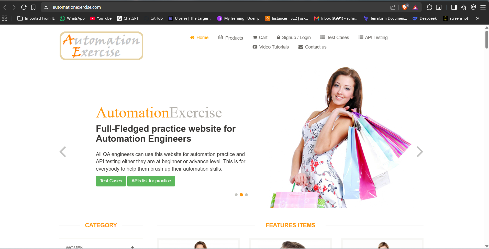
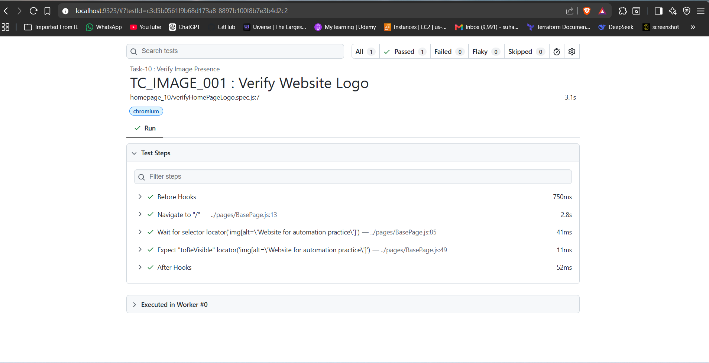

# 🚀 Task-10: Verify Image Presence | Playwright JavaScript Automation

---

# 📖 Project Overview

This task automates the verification of the website logo available on the **Automation Exercise** homepage using **Playwright with JavaScript**.

The objective is to verify that the logo image is displayed successfully after the homepage loads.

Unlike previous tasks, no new reusable methods were added to the framework. Instead, this task demonstrates the effective reuse of the existing **BasePage** methods to synchronize the page and validate UI elements.

The framework follows industry-standard automation practices including:

- Page Object Model (POM)
- Base Page Architecture
- Reusable Methods
- JSON Test Data
- Constants File
- Playwright Assertions
- ES Modules (Import / Export)

---

# 📋 Test Case Information

| Field | Details |
|-------|---------|
| **Test Case ID** | TC_IMAGE_001 |
| **Module** | Home Page |
| **Feature** | Logo Verification |
| **Scenario** | Verify Website Logo Visibility |
| **Test Type** | Functional Testing |
| **Execution Type** | Automated |
| **Priority** | High |
| **Severity** | Medium |
| **Automation Tool** | Playwright |
| **Programming Language** | JavaScript |
| **Framework Pattern** | Page Object Model (POM) + BasePage |
| **Execution Status** | ✅ Passed |

---

# 🎯 Objective

Verify that the website logo is displayed successfully after navigating to the Automation Exercise homepage.

---

# 🌐 Application Under Test

| Property | Value |
|----------|-------|
| Application | Automation Exercise |
| Module | Home Page |
| URL | https://automationexercise.com/ |
| Environment | Demo |

---

# 🛠 Technology Stack

| Technology | Version |
|------------|----------|
| Node.js | v22.11.0 |
| Playwright | v1.61.1 |
| JavaScript | ES6 |
| VS Code | IDE |
| Git | Version Control |
| GitHub | Repository Hosting |

---

# 🏗 Framework Enhancement

## Version

**Version 2.3**

### Framework Improvements

This task focuses on **framework reusability** instead of introducing new methods.

The `verifyLogoDisplayed()` method internally reuses two existing BasePage methods:

- ✅ `waitForVisible(locator)`
- ✅ `verifyVisible(locator)`

This improves test stability by ensuring the logo becomes visible before performing the assertion.

---

# 📁 Project Structure

```text
playwright-practice-js
│
├── docs
│   └── task-10
│       ├── README.md
│       └── screenshots
│
├── pages
│   └── AutomationExerciseHomePage.js
│
├── testData
│   └── homePageData.json
│
├── tests
│   └── homepage
│       └── verifyHomePageLogo.spec.js
│
├── utils
│   └── constants.js
│
├── playwright.config.js
│
└── package.json
```

---

# 📌 Test Data

```json
{
    "logoAltText": "Website for automation practice"
}
```

---

# 📌 Preconditions

- Node.js installed
- Playwright installed
- Browser dependencies installed
- Internet connection available
- Automation Exercise website is accessible

---

# 📝 Test Steps

| Step | Action | Expected Result |
|------|--------|----------------|
| 1 | Launch Browser | Browser opens successfully |
| 2 | Navigate to Home Page | Home page loads successfully |
| 3 | Wait until logo is visible | Logo becomes visible |
| 4 | Verify logo visibility | Assertion passes |

---

# ✅ Expected Result

The Automation Exercise logo should be displayed successfully.

---

# 📌 Postconditions

- Logo validation completed successfully.
- Browser closed.

---

# ⚙ Automation Approach

- Page Object Model (POM)
- BasePage Architecture
- Reusable Methods
- Playwright Assertions
- ES Modules

---

# 🎯 Playwright Concepts Used

- Image Validation
- Element Visibility
- Assertions
- CSS Selectors
- Page Object Model
- BasePage Reusability

---

# 🔄 BasePage Methods Reused

| Method | Purpose |
|---------|---------|
| navigate() | Navigate to application |
| waitForVisible() | Wait until logo becomes visible |
| verifyVisible() | Validate logo visibility |

---

# ✔ Assertion Used

```javascript
await expect(locator).toBeVisible();
```

---

# ▶ Test Execution

Run complete suite

```bash
npx playwright test
```

Run Task-10

```bash
npx playwright test tests/homepage/verifyHomePageLogo.spec.js --headed
```

Generate HTML Report

```bash
npx playwright show-report
```

---

# 🌍 Browser Support

- Chromium
- Firefox
- WebKit

---

# 📊 Test Execution Status

| Browser | Result |
|----------|--------|
| Chromium | ✅ Passed |

---

# 📷 Test Execution Evidence

## Home Page



---

## Logo Validation


---

## Playwright HTML Report



---

# 🌿 Git Branch

```
feature/task-10-verify-image-presence
```

---

# ⚠ Challenges Faced

- Synchronizing page load before validating the logo.
- Ensuring the image is visible before assertion.

---

# ✅ Solution Implemented

- Reused `waitForVisible()` from BasePage.
- Reused `verifyVisible()` from BasePage.
- Followed Page Object Model.
- Used CSS selector for logo identification.

---

# 📚 Learning Outcome

- Learned image validation using Playwright.
- Improved framework reusability.
- Understood the importance of synchronization before assertions.
- Continued following industry-standard Page Object Model.

---

# 💡 Best Practices Followed

- Page Object Model
- BasePage Reusability
- Explicit Waits
- Clean Code
- Feature Branch Workflow
- Professional Folder Structure

---

# 📈 Framework Metrics

| Metric | Value |
|---------|------|
| Test Cases | 1 |
| Page Objects | 1 |
| BasePage Methods Reused | 3 |
| Assertions | 1 |
| JSON Files | 1 |

---

# 🚀 Future Enhancements

- Screenshot on Failure
- Soft Assertions
- Allure Reporting
- GitHub Actions
- Jenkins Integration

---

# 👨‍💻 Author

**Sohel Shaikh**

QA Automation Engineer

---

# 📄 License

This project is created for learning and portfolio purposes.