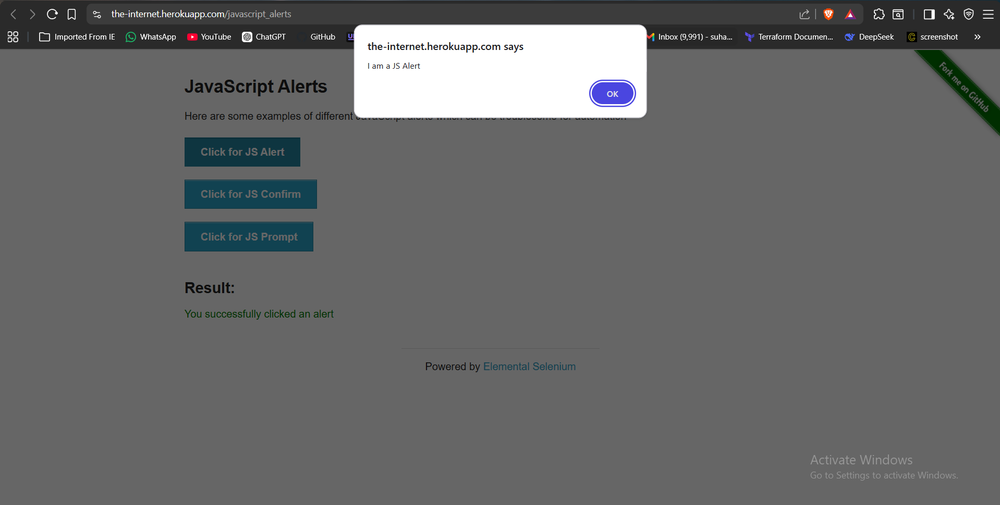
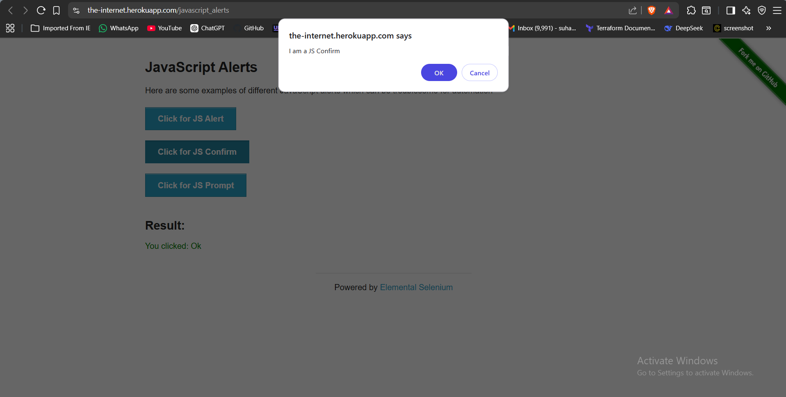
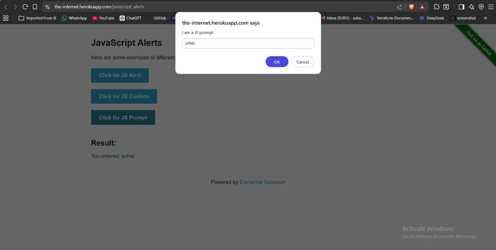
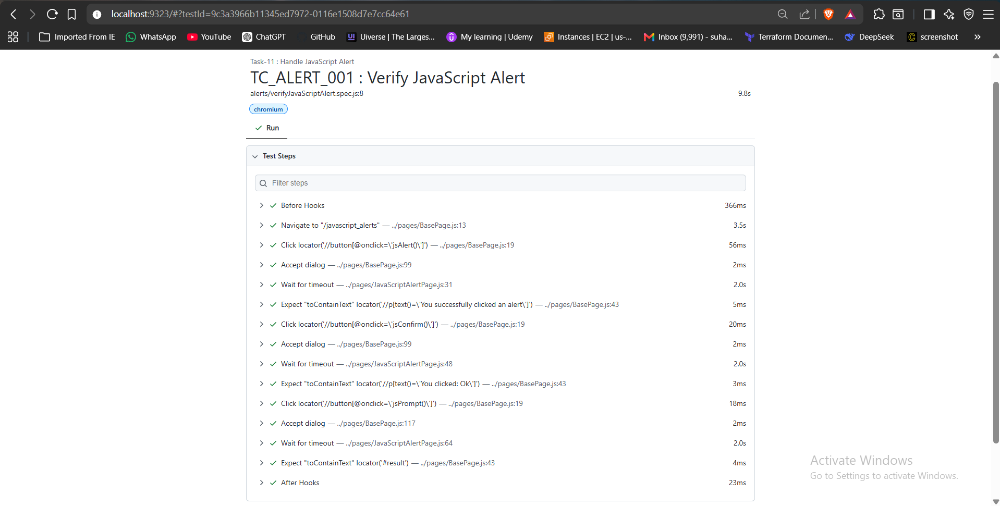

# 🚀 Task-11: Handle JavaScript Alert | Playwright JavaScript Automation

---

# 📖 Project Overview

This task automates the handling of JavaScript dialogs available on **The Internet** website using **Playwright with JavaScript**.

The objective is to validate all three JavaScript dialog types:

- JavaScript Alert
- JavaScript Confirm
- JavaScript Prompt

The framework follows industry-standard automation practices including:

- Page Object Model (POM)
- Base Page Architecture
- Reusable Methods
- JSON Test Data
- Constants File
- Playwright Assertions
- ES Modules (Import / Export)

---

# 📋 Test Case Information

| Field | Details |
|-------|---------|
| **Task** | Task-11 |
| **Module** | JavaScript Alerts |
| **Feature** | Alert Handling |
| **Scenario** | Handle Alert, Confirm and Prompt Dialogs |
| **Test Type** | Functional Testing |
| **Execution Type** | Automated |
| **Priority** | High |
| **Severity** | High |
| **Automation Tool** | Playwright |
| **Programming Language** | JavaScript |
| **Framework Pattern** | Page Object Model (POM) |
| **Execution Status** | ✅ Passed |

---

# 🎯 Objective

Validate all JavaScript dialog types by handling browser alerts and verifying the displayed result messages.

---

# 🌐 Application Under Test

| Property | Value |
|----------|-------|
| Application | The Internet |
| Module | JavaScript Alerts |
| URL | https://the-internet.herokuapp.com/javascript_alerts |
| Environment | Demo |

---

# 🛠 Technology Stack

| Technology | Version |
|------------|----------|
| Node.js | v22.11.0 |
| Playwright | v1.61.1 |
| JavaScript | ES6 |
| VS Code | IDE |
| Git | Version Control |
| GitHub | Repository Hosting |

---

# 🏗 Framework Enhancement

## Version

**Version 2.4**

### New Reusable Methods Added to BasePage

This task enhanced the framework by introducing reusable methods for browser dialog handling.

### Added Methods

| Method | Purpose |
|---------|---------|
| acceptAlert() | Accept JavaScript Alert |
| dismissAlert() | Dismiss JavaScript Confirm |
| promptAlert(text) | Accept Prompt and enter text |

These reusable methods can now be used across future automation scenarios without writing dialog handling logic repeatedly.

---

# 📁 Project Structure

```text
playwright-practice-js
│
├── docs
│   └── task-11
│       ├── README.md
│       └── screenshots
│
├── pages
│   └── JavaScriptAlertPage.js
│
├── testData
│   └── javaScriptAlertData.json
│
├── tests
│   └── alerts
│       └── verifyJavaScriptAlert.spec.js
│
├── utils
│   └── constants.js
│
├── playwright.config.js
│
└── package.json
```

---

# 📌 Test Data

```json
{
    "text": "sohel",
    "expectedResult_1": "You successfully clicked an alert",
    "expectedResult_2": "You clicked: Ok",
    "expectedResult_3": "You entered: sohel"
}
```

---

# 📌 Preconditions

- Node.js installed
- Playwright installed
- Browser dependencies installed
- Internet connection available
- The Internet application is accessible

---

# 📝 Test Steps

## JavaScript Alert

1. Launch browser
2. Navigate to JavaScript Alerts page
3. Click **Click for JS Alert**
4. Accept alert
5. Verify success message

---

## JavaScript Confirm

1. Click **Click for JS Confirm**
2. Accept confirm dialog
3. Verify confirmation message

---

## JavaScript Prompt

1. Click **Click for JS Prompt**
2. Enter text **"sohel"**
3. Accept prompt
4. Verify entered text

---

# ✅ Expected Results

### Alert

```
You successfully clicked an alert
```

### Confirm

```
You clicked: Ok
```

### Prompt

```
You entered: sohel
```

---

# 📌 Postconditions

- Alert handled successfully.
- Confirm dialog handled successfully.
- Prompt handled successfully.
- Browser closed.

---

# ⚙ Automation Approach

- Page Object Model (POM)
- BasePage Architecture
- JSON Test Data
- Reusable Dialog Methods
- Playwright Assertions

---

# 🎯 Playwright Concepts Used

- JavaScript Alert
- JavaScript Confirm
- JavaScript Prompt
- page.once()
- dialog.accept()
- dialog.dismiss()
- Prompt Input
- Assertions
- Page Object Model

---

# 🔄 BasePage Methods Used

| Method | Purpose |
|---------|---------|
| navigate() | Navigate to page |
| click() | Click buttons |
| verifyText() | Validate result message |
| acceptAlert() | Handle Alert |
| dismissAlert() | Handle Confirm |
| promptAlert() | Handle Prompt |

---

# ✔ Assertions Used

```javascript
await expect(locator).toContainText(expectedText);
```

---

# ▶ Test Execution

Run complete suite

```bash
npx playwright test
```

Run Task-11

```bash
npx playwright test tests/alerts/verifyJavaScriptAlert.spec.js --headed
```

Generate HTML Report

```bash
npx playwright show-report
```

---

# 🌍 Browser Support

- Chromium
- Firefox
- WebKit

---

# 📊 Test Execution Status

| Browser | Result |
|----------|--------|
| Chromium | ✅ Passed |

---

# 📷 Test Execution Evidence

## JavaScript Alert





---

## JavaScript Confirm





---

## JavaScript Prompt





---

## Playwright HTML Report





---

# 🌿 Git Branch

```
feature/task-11-javascript-alert
```

---

# ⚠ Challenges Faced

- Understanding Playwright dialog event handling.
- Registering dialog listeners before triggering alerts.
- Passing text to JavaScript Prompt.
- Avoiding duplicate dialog handlers.

---

# ✅ Solution Implemented

- Used `page.once()` to register one-time dialog listeners.
- Registered listeners before clicking dialog buttons.
- Created reusable alert methods inside BasePage.
- Followed Page Object Model architecture.

---

# 📚 Learning Outcome

- Learned Playwright browser event handling.
- Understood the importance of registering listeners before triggering dialogs.
- Learned handling Alert, Confirm and Prompt dialogs.
- Improved framework reusability by adding common dialog methods.

---

# 💡 Best Practices Followed

- Page Object Model
- BasePage Reusability
- Reusable Dialog Handling
- JSON Test Data
- Clean Code
- Feature Branch Workflow

---

# 📈 Framework Metrics

| Metric | Value |
|---------|------|
| Dialog Types Automated | 3 |
| New BasePage Methods | 3 |
| Assertions | 3 |
| Test Cases | 3 |
| JSON Files | 1 |

---

# 🚀 Future Enhancements

- Alert Logging
- Screenshot on Failure
- Soft Assertions
- Allure Reporting
- GitHub Actions
- Jenkins Integration

---

# 👨‍💻 Author

**Sohel Shaikh**

QA Automation Engineer

---

# 📄 License

This project is created for learning and portfolio purposes.