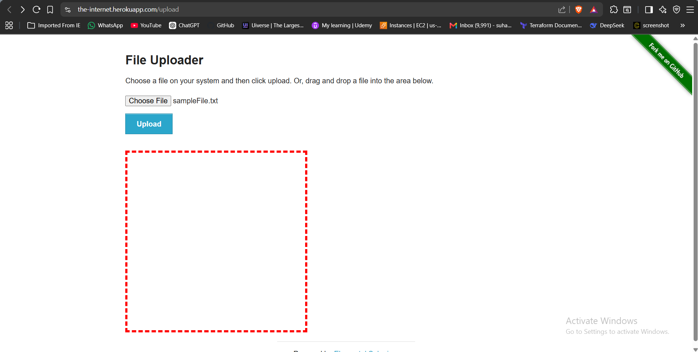
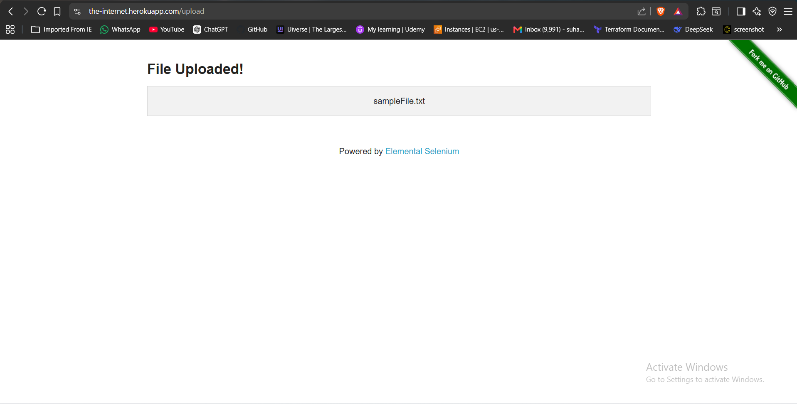
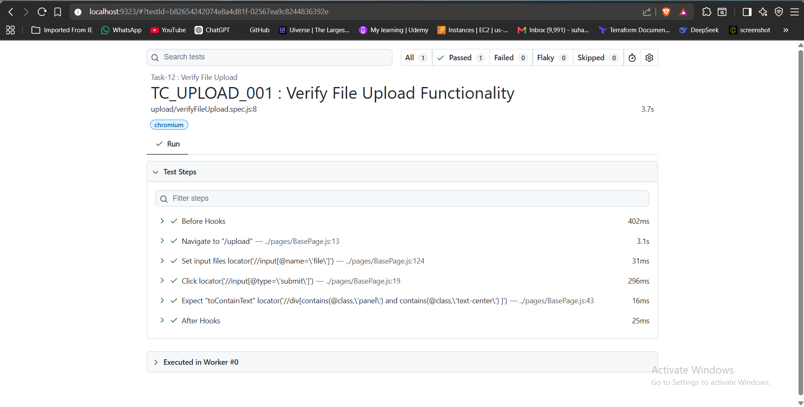

# 🚀 Task-12: Verify File Upload | Playwright JavaScript Automation

---

# 📖 Project Overview

This task automates the File Upload functionality available on **The Internet Herokuapp** using **Playwright with JavaScript**.

The automation validates that a user can upload a file successfully and verifies the uploaded filename displayed on the application.

The framework follows industry-standard automation practices including:

- Page Object Model (POM)
- Base Page Architecture
- Reusable Methods
- JSON Test Data
- Constants File
- Playwright Assertions
- ES Modules (Import / Export)

---

# 📋 Test Case Information

| Field | Details |
|-------|---------|
| **Task** | Task-14 |
| **Module** | File Upload |
| **Feature** | Upload File |
| **Scenario** | Upload a file and verify uploaded filename |
| **Test Type** | Functional Testing |
| **Execution Type** | Automated |
| **Priority** | High |
| **Severity** | Medium |
| **Automation Tool** | Playwright |
| **Programming Language** | JavaScript |
| **Framework Pattern** | Page Object Model (POM) |
| **Execution Status** | ✅ Passed |

---

# 🎯 Objective

Validate that a user can successfully upload a file and verify that the uploaded filename is displayed correctly.

---

# 🌐 Application Under Test

| Property | Value |
|----------|-------|
| Application | The Internet Herokuapp |
| Module | File Upload |
| URL | https://the-internet.herokuapp.com/upload |
| Environment | Demo |

---

# 🛠 Technology Stack

| Technology | Version |
|------------|----------|
| Node.js | v22.11.0 |
| Playwright | v1.61.1 |
| JavaScript | ES6 |
| VS Code | IDE |
| Git | Version Control |
| GitHub | Repository Hosting |

---

# 🏗 Framework Enhancement

## Version

**Version 2.8**

### New Reusable Method Added to BasePage

This task enhanced the framework by introducing a reusable method for file upload.

### Added Method

| Method | Purpose |
|---------|---------|
| uploadFile(locator, filePath) | Upload file using Playwright setInputFiles() |

This reusable method can now be used for future scenarios like:

- Resume Upload
- Profile Picture Upload
- Document Upload
- Image Upload
- Attachment Upload

without rewriting upload logic.

---

# 📁 Project Structure

```text
playwright-practice-js
│
├── docs
│   └── task-14
│       ├── README.md
│       └── screenshots
│
├── pages
│   └── FileUploadPage.js
│
├── testData
│   ├── fileUploadData.json
│   └── sampleFile.txt
│
├── tests
│   └── upload
│       └── verifyFileUpload.spec.js
│
├── utils
│   └── constants.js
│
├── playwright.config.js
│
└── package.json
```

---

# 📌 Test Data

### fileUploadData.json

```json
{
    "fileName": "sampleFile.txt"
}
```

### Sample File

```
sampleFile.txt
```

---

# 📌 Preconditions

- Node.js installed
- Playwright installed
- Browser dependencies installed
- Internet connection available
- Sample file present inside testData folder

---

# 📝 Test Steps

1. Launch browser
2. Navigate to File Upload page
3. Click Choose File
4. Upload sampleFile.txt
5. Click Upload button
6. Verify uploaded filename

---

# ✅ Expected Result

```
File Uploaded!

sampleFile.txt
```

---

# 📌 Postconditions

- File uploaded successfully.
- Uploaded filename displayed.
- Browser closed.

---

# ⚙ Automation Approach

- Page Object Model (POM)
- BasePage Architecture
- JSON Test Data
- Constants File
- Reusable Upload Method
- Playwright Assertions

---

# 🎯 Playwright Concepts Used

- setInputFiles()
- File Upload
- path.resolve()
- Assertions
- Page Object Model
- BasePage Reusability

---

# 🔄 BasePage Methods Used

| Method | Purpose |
|---------|---------|
| navigate() | Navigate to application |
| uploadFile() | Upload file |
| click() | Click Upload button |
| verifyText() | Verify uploaded filename |

---

# ✔ Assertions Used

```javascript
await expect(locator).toContainText(expectedText);
```

---

# ▶ Test Execution

Run complete suite

```bash
npx playwright test
```

Run Task-14

```bash
npx playwright test tests/upload/verifyFileUpload.spec.js --headed
```

Generate HTML Report

```bash
npx playwright show-report
```

---

# 🌍 Browser Support

- Chromium
- Firefox
- WebKit

---

# 📊 Test Execution Status

| Browser | Result |
|----------|--------|
| Chromium | ✅ Passed |

---

# 📷 Test Execution Evidence

## Uploaded File





---

## Upload Success Message





---

## Playwright HTML Report





---

# 🌿 Git Branch

```
feature/task-14-file-upload
```

---

# ⚠ Challenges Faced

- Understanding Playwright file upload mechanism.
- Managing file paths across different operating systems.
- Implementing reusable upload functionality.
- Using absolute paths with path.resolve().

---

# ✅ Solution Implemented

- Used Playwright's setInputFiles() for uploading files.
- Used path.resolve() to generate an absolute file path.
- Added uploadFile() as a reusable BasePage method.
- Verified uploaded filename using Playwright assertions.

---

# 📚 Learning Outcome

- Learned file upload automation using Playwright.
- Understood the difference between relative and absolute file paths.
- Learned how path.resolve() creates platform-independent paths.
- Improved framework reusability with a dedicated upload method.

---

# 💡 Best Practices Followed

- Page Object Model
- BasePage Reusability
- JSON Test Data
- Clean Code
- Feature Branch Workflow
- Reusable Utility Methods

---

# 📈 Framework Metrics

| Metric | Value |
|--------|-------|
| Test Cases | 1 |
| Assertions | 1 |
| New BasePage Methods | 1 |
| Uploaded Files | 1 |
| JSON Files | 1 |

---

# 🚀 Future Enhancements

- Multiple File Upload
- Drag and Drop Upload
- File Size Validation
- Screenshot on Failure
- Allure Report
- GitHub Actions
- Jenkins Integration

---

# 👨‍💻 Author

**Sohel Shaikh**

QA Automation Engineer

---

# 📄 License

This project is created for learning and portfolio purposes.