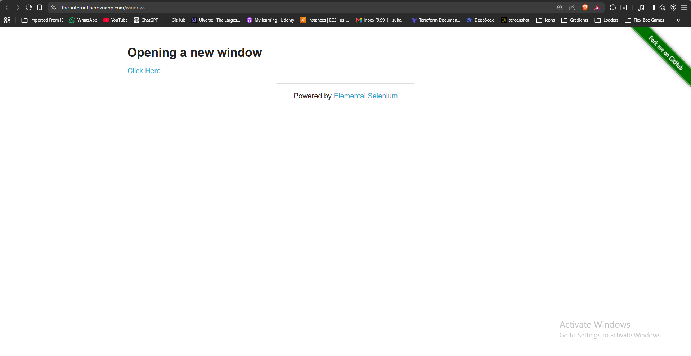
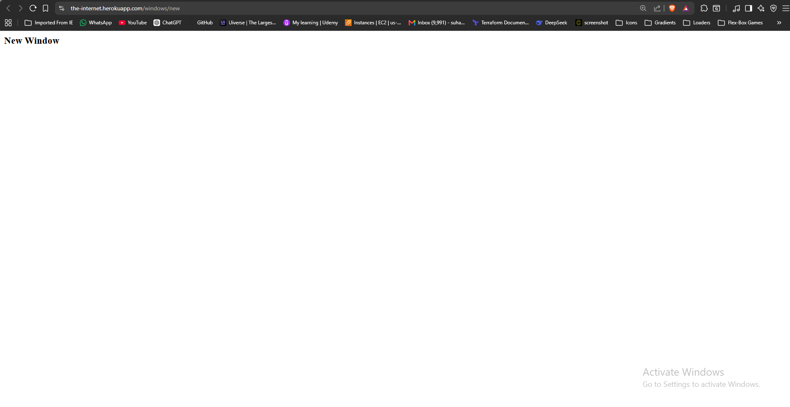
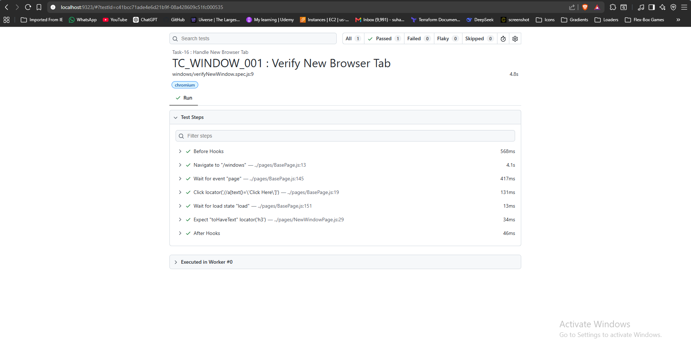

# 🚀 Task-14: Handle New Browser Tab | Playwright JavaScript Automation

---

# 📖 Project Overview

This task automates the **New Browser Tab** functionality available on **The Internet Herokuapp** using **Playwright with JavaScript**.

The automation verifies that clicking the **"Click Here"** link opens a new browser tab, switches control to the newly opened tab, and validates the page heading.

The framework follows industry-standard automation practices including:

- Page Object Model (POM)
- Base Page Architecture
- Reusable Methods
- JSON Test Data
- Constants File
- Playwright Assertions
- ES Modules (Import / Export)

---

# 📋 Test Case Information

| Field | Details |
|-------|---------|
| **Task** | Task-14 |
| **Module** | Multiple Windows |
| **Feature** | New Browser Tab |
| **Scenario** | Open a new browser tab and validate page heading |
| **Test Type** | Functional Testing |
| **Execution Type** | Automated |
| **Priority** | High |
| **Severity** | Medium |
| **Automation Tool** | Playwright |
| **Programming Language** | JavaScript |
| **Framework Pattern** | Page Object Model (POM) |
| **Execution Status** | ✅ Passed |

---

# 🎯 Objective

Validate that clicking the **Click Here** link opens a new browser tab successfully and verify the heading displayed on the new page.

---

# 🌐 Application Under Test

| Property | Value |
|----------|-------|
| Application | The Internet Herokuapp |
| Module | Multiple Windows |
| URL | https://the-internet.herokuapp.com/windows |
| Environment | Demo |

---

# 🛠 Technology Stack

| Technology | Version |
|------------|----------|
| Node.js | v22.11.0 |
| Playwright | v1.61.1 |
| JavaScript | ES6 |
| VS Code | IDE |
| Git | Version Control |
| GitHub | Repository Hosting |

---

# 🏗 Framework Enhancement

## Version

**Version 3.0**

### New Reusable Method Added to BasePage

| Method | Purpose |
|---------|---------|
| openNewTab(locator) | Opens and switches to a newly created browser tab |

### Benefits

The reusable method can now be used for:

- Terms & Conditions
- Privacy Policy
- External Links
- Payment Gateway
- PDF Preview
- Reports
- Help Center
- Documentation Pages

without writing new tab handling logic again.

---

# 📁 Project Structure

```text
playwright-practice-js
│
├── docs
│   └── task-14
│       ├── README.md
│       └── screenshots
│
├── pages
│   └── NewWindowPage.js
│
├── testData
│   └── newWindowData.json
│
├── tests
│   └── windows
│       └── verifyNewWindow.spec.js
│
├── utils
│   └── constants.js
│
├── playwright.config.js
│
└── package.json
```

---

# 📌 Test Data

### newWindowData.json

```json
{
    "expectedHeading": "New Window"
}
```

---

# 📌 Preconditions

- Node.js installed
- Playwright installed
- Browser dependencies installed
- Internet connection available

---

# 📝 Test Steps

1. Launch browser.
2. Navigate to Multiple Windows page.
3. Click the **Click Here** link.
4. Wait for a new browser tab to open.
5. Switch control to the new tab.
6. Wait for the page to load.
7. Verify the heading displayed on the new page.

---

# ✅ Expected Result

- A new browser tab opens successfully.
- Browser focus switches to the new tab.
- The page heading displays:

```

New Window

```

---

# 📌 Postconditions

- New tab handled successfully.
- Page heading verified.
- Browser closed.

---

# ⚙ Automation Approach

- Page Object Model (POM)
- BasePage Architecture
- JSON Test Data
- Constants File
- Reusable New Tab Method
- Playwright Assertions

---

# 🎯 Playwright Concepts Used

- Browser Context
- context.waitForEvent("page")
- waitForLoadState()
- Multiple Browser Tabs
- Page Object Model
- Assertions

---

# 🔄 BasePage Methods Used

| Method | Purpose |
|---------|---------|
| navigate() | Navigate to application |
| click() | Click Click Here link |
| openNewTab() | Open and switch to new browser tab |

---

# ✔ Assertions Used

Verified the page heading after switching to the newly opened browser tab.

---

# ▶ Test Execution

Run complete suite

```bash
npx playwright test
```

Run Task-14

```bash
npx playwright test tests/windows/verifyNewWindow.spec.js --headed
```

Generate HTML Report

```bash
npx playwright show-report
```

---

# 🌍 Browser Support

- Chromium
- Firefox
- WebKit

---

# 📊 Test Execution Status

| Browser | Result |
|----------|--------|
| Chromium | ✅ Passed |

---

# 📷 Test Execution Evidence

## Multiple Windows Page





## New Browser Tab





## Playwright HTML Report





---

# 🌿 Git Branch

```
feature/task-14-new-browser-tab
```

---

# ⚠ Challenges Faced

- Understanding Browser Context.
- Capturing newly opened browser tabs.
- Synchronizing tab creation with Playwright.
- Switching control from parent page to child page.

---

# ✅ Solution Implemented

- Registered `context.waitForEvent("page")` before clicking the link.
- Switched to the newly opened browser tab.
- Waited for the page to finish loading.
- Validated the page heading successfully.
- Added a reusable `openNewTab()` method to BasePage.

---

# 📚 Learning Outcome

- Learned how Playwright handles multiple browser tabs.
- Understood Browser Context.
- Learned why `waitForEvent("page")` should be called before clicking.
- Improved framework reusability using a dedicated BasePage method.

---

# 💡 Best Practices Followed

- Page Object Model
- BasePage Reusability
- Clean Code
- JSON Test Data
- Feature Branch Workflow
- Modular Framework Design

---

# 📈 Framework Metrics

| Metric | Value |
|--------|-------|
| Test Cases | 1 |
| Assertions | 1 |
| New BasePage Methods | 1 |
| Browser Tabs Handled | 1 |
| JSON Files | 1 |

---

# 🚀 Future Enhancements

- Multiple Child Windows
- Window Count Validation
- Parent Window Navigation
- Screenshot on Failure
- Allure Report
- GitHub Actions
- Jenkins CI/CD Integration

---

# 👨‍💻 Author

**Sohel Shaikh**

QA Automation Engineer

---

# 📄 License

This project is created for learning and portfolio purposes.