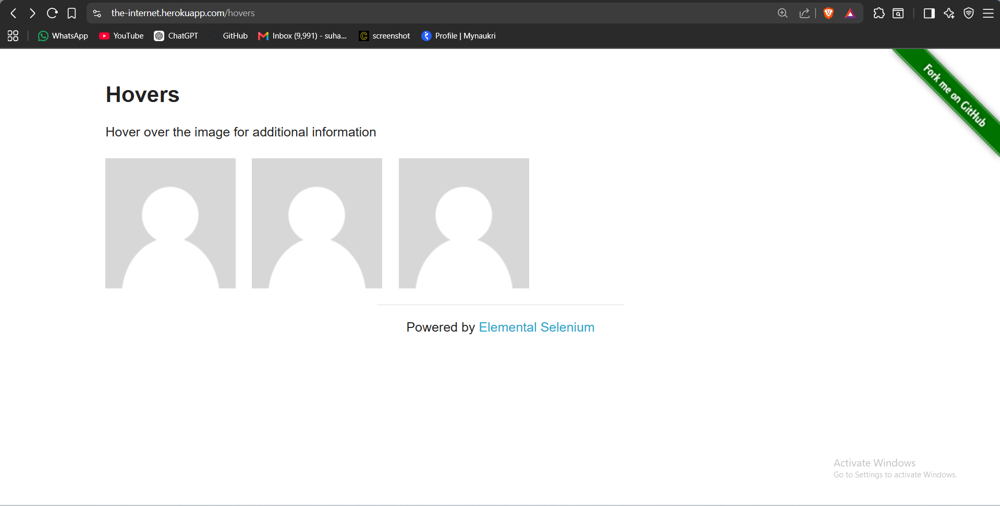
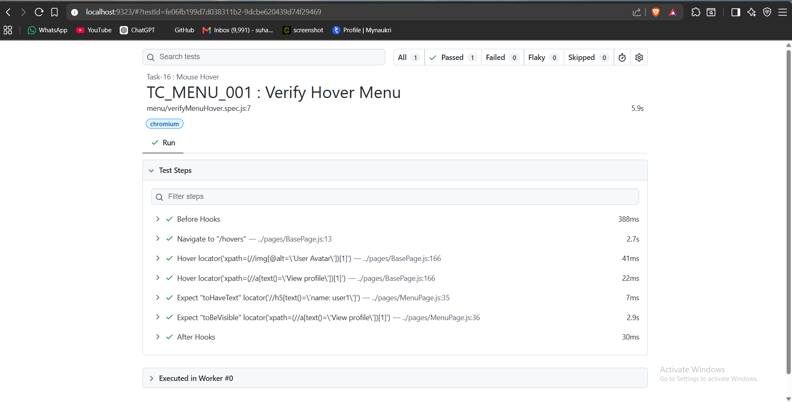

# 🚀 Task-16: Mouse Hover Using Playwright

## 📖 Project Overview

This task demonstrates how to automate **Mouse Hover** functionality using **Playwright with JavaScript**.

The automation performs a hover action on a user image and verifies that hidden profile information becomes visible after hovering.

The framework follows the **Page Object Model (POM)** design pattern with reusable methods implemented in the BasePage class.

---

# 🎯 Objective

Verify that hidden profile details are displayed when the mouse hovers over the first user image.

---

# 🌐 Application Under Test

| Property | Value |
|----------|-------|
| Website | The Internet |
| URL | https://the-internet.herokuapp.com/hovers |
| Module | Mouse Hover |

---

# 🛠 Technology Stack

| Technology | Version |
|------------|----------|
| Node.js | v22.11.0 |
| Playwright | v1.61.1 |
| JavaScript | ES6 |
| VS Code | IDE |
| Git | Version Control |
| GitHub | Repository Hosting |

---

# 🏗 Framework Design

- Page Object Model (POM)
- BasePage Reusable Methods
- JSON Test Data
- Constants File
- Playwright Assertions
- ES Modules (Import / Export)

---

# 📁 Project Structure

```text
playwright-practice-js
│
├── docs
│   └── task-16
│       ├── README.md
│       └── screenshots
│
├── pages
│   └── HoverPage.js
│
├── testData
│   └── hoverData.json
│
├── tests
│   └── hover
│       └── verifyHover.spec.js
│
├── utils
│   └── constants.js
│
└── package.json
```

---

# 📋 Test Case Information

| Field | Details |
|-------|---------|
| Task | Task-16 |
| Module | Mouse Hover |
| Scenario | Verify profile information after mouse hover |
| Test Type | Functional Testing |
| Automation Tool | Playwright |
| Execution Status | ✅ Passed |

---

# 📌 Preconditions

- Node.js installed
- Playwright installed
- Internet connection available

---

# 📝 Test Steps

1. Launch the browser.
2. Navigate to the Hovers page.
3. Hover over the first user image.
4. Verify the user name becomes visible.
5. Verify the **View profile** link is displayed.

---

# ✅ Expected Result

- Hover action should be performed successfully.
- User profile information should appear.
- "View profile" link should be visible.

---

# 📌 Postconditions

- Profile details verified.
- Browser closed.

---

# 🔄 BasePage Methods Used

| Method | Purpose |
|---------|---------|
| navigate() | Open application URL |
| hover() | Perform mouse hover |
| getLocator() | Return Playwright locator |

---

# 🎯 Playwright Concepts Used

- hover()
- locator()
- expect()
- toBeVisible()
- toHaveText()

---

# ✔ Assertion Used

```javascript
await expect(locator).toHaveText(expectedUser);

await expect(locator).toBeVisible();
```

---

# ▶ Test Execution

Run complete suite

```bash
npx playwright test
```

Run Task-16 only

```bash
npx playwright test tests/hover/verifyHover.spec.js --headed
```

Generate HTML Report

```bash
npx playwright show-report
```

---

# 📷 Execution Evidence

## Home Page

The application home page before performing the hover action.



---

## Mouse Hover Action

Mouse hovered over the first user image and the hidden profile information is displayed successfully.


---

## Verification Result

User name and **View Profile** link displayed after hover.


---

## Playwright HTML Report

Successful execution shown in the Playwright HTML Report.



---

# 🌿 Git Branch

feature/task-16-mouse-hover

---

# ⚠ Challenges Faced

- Selecting stable hover demo website.
- Locating hidden elements.
- Performing hover action before verification.

---

# ✅ Solution

- Used Playwright's hover() method.
- Added reusable hover() method in BasePage.
- Verified profile information using Playwright assertions.

---

# 📚 Learning Outcome

- Learned Mouse Hover automation.
- Worked with hidden UI elements.
- Improved BasePage reusability.
- Strengthened Page Object Model implementation.

---

# 📈 Framework Enhancement

## New Reusable Method

```javascript
async hover(locator)
{
    await this.page.locator(locator).hover();
}
```

### Benefit

This method can now be reused for:

- Navigation Menus
- Mega Menus
- User Profile Dropdowns
- Product Cards
- Tooltips
- Hidden Controls

---

# 🚀 Future Enhancements

- Screenshot on failure
- Retry mechanism
- Cross-browser execution
- Jenkins CI/CD
- GitHub Actions
- Allure Reporting

---

# 👨‍💻 Author

**Sohel Shaikh**

QA Automation Engineer

---

# 📄 License

This project is created for learning and portfolio purposes.