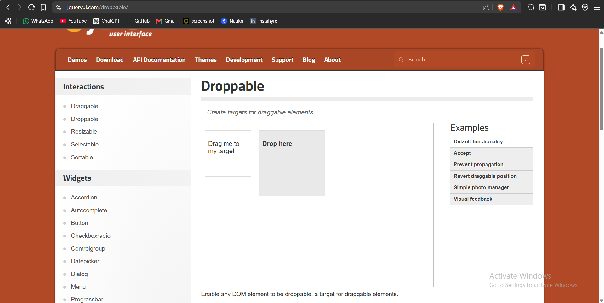
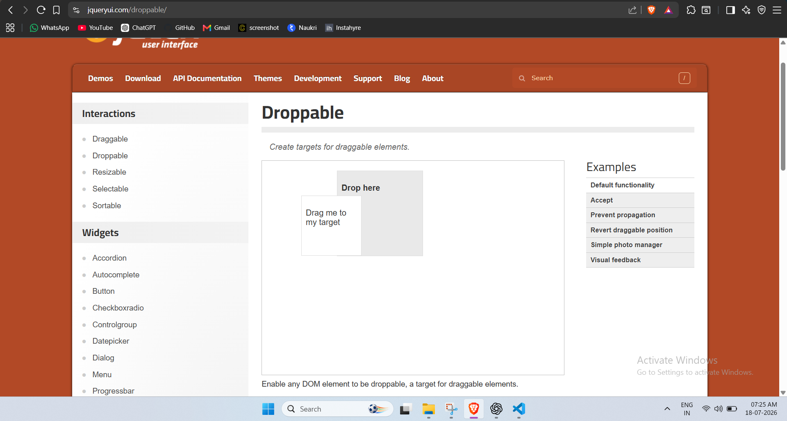
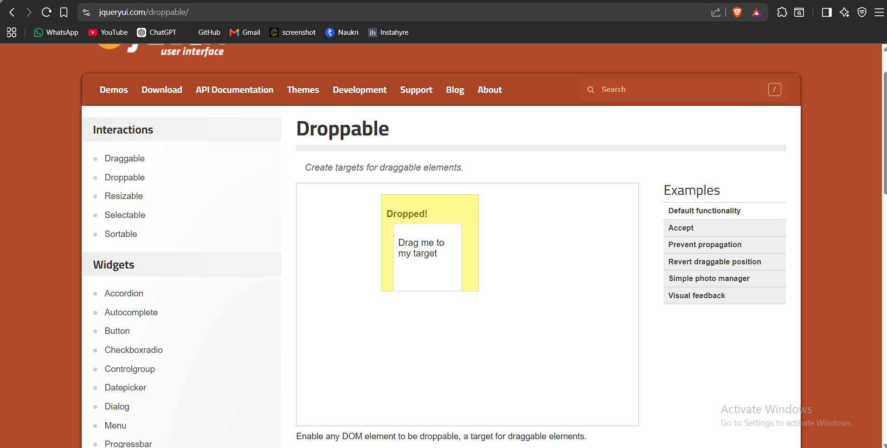
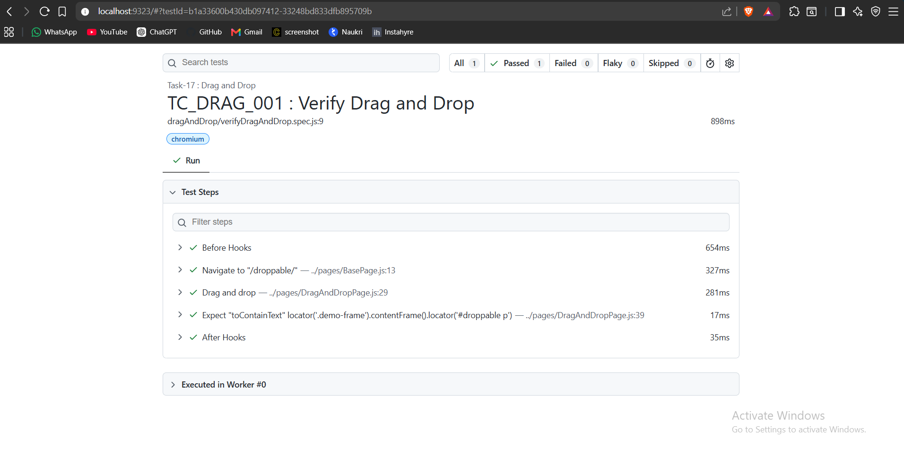

# 🚀 Task-17: Drag and Drop Using Playwright

---

# 📖 Project Overview

This task demonstrates how to automate **Drag and Drop** functionality using **Playwright with JavaScript**.

The automation performs a drag-and-drop operation on a draggable element and verifies that the element is successfully dropped onto the target area.

This implementation follows the **Page Object Model (POM)** design pattern with reusable methods from the **BasePage** class.

---

# 🎯 Objective

Verify that a draggable element can be successfully dragged and dropped onto the target element.

---

# 🌐 Application Under Test

| Property | Value |
|----------|-------|
| Website | jQuery UI |
| URL | https://jqueryui.com/droppable/ |
| Module | Drag and Drop |
| Environment | Demo |

---

# 🛠 Technology Stack

| Technology | Version |
|------------|----------|
| Node.js | v22.11.0 |
| Playwright | v1.61.1 |
| JavaScript | ES6 |
| VS Code | IDE |
| Git | Version Control |
| GitHub | Repository Hosting |

---

# 🏗 Framework Design

- Page Object Model (POM)
- BasePage Reusable Methods
- JSON Test Data
- Constants File
- Playwright Assertions
- ES Modules (Import / Export)

---

# 📋 Test Case Information

| Field | Details |
|-------|---------|
| Task | Task-17 |
| Module | Drag and Drop |
| Scenario | Verify Drag and Drop |
| Test Type | Functional Testing |
| Execution Type | Automated |
| Priority | High |
| Execution Status | ✅ Passed |

---

# 📁 Project Structure

```text
playwright-practice-js
│
├── docs
│   └── task-17
│       ├── README.md
│       └── screenshots
│
├── pages
│   └── DragAndDropPage.js
│
├── testData
│   └── dragAndDropData.json
│
├── tests
│   └── dragAndDrop
│       └── verifyDragAndDrop.spec.js
│
├── utils
│   └── constants.js
│
└── package.json
```

---

# 📌 Test Data

### dragAndDropData.json

```json
{
    "expectedMessage": "Dropped!"
}
```

---

# 📌 Preconditions

- Node.js installed
- Playwright installed
- Internet connection available

---

# 📝 Test Steps

1. Launch browser.
2. Navigate to jQuery UI Droppable page.
3. Switch to the demo iframe.
4. Drag the source element.
5. Drop it onto the target.
6. Verify the target displays **Dropped!**

---

# ✅ Expected Result

- Drag operation should be successful.
- Target element should display **Dropped!**

---

# 📌 Postconditions

- Drag and Drop completed successfully.
- Browser closed.

---

# 🔄 BasePage Methods Used

| Method | Purpose |
|---------|---------|
| navigate() | Open application |
| getFrame() | Access iframe |
| dragAndDrop() | Perform drag-and-drop |
| getLocator() | Return locator |

---

# 🎯 Playwright Concepts Used

- frameLocator()
- dragTo()
- locator()
- expect()
- toHaveText()

---

# ✔ Assertion Used

```javascript
await expect(frame.locator(this.target))
    .toContainText(expectedMessage);
```

---

# ▶ Test Execution

Run complete suite

```bash
npx playwright test
```

Run Task-17

```bash
npx playwright test tests/dragAndDrop/verifyDragAndDrop.spec.js --headed
```

Generate HTML Report

```bash
npx playwright show-report
```

---

# 📸 Screenshots

## Home Page

Application before performing drag and drop.



---

## Drag Operation

Dragging the source element.



---

## Drop Successful

Target area displays **Dropped!**



---

## Playwright HTML Report

Successful execution report.



---

# 🌿 Git Branch

```
feature/task-17-drag-and-drop
```

---

# ⚠ Challenges Faced

- Working with elements inside an iframe.
- Understanding `frameLocator()`.
- Using `dragTo()` correctly within the same iframe.
- Selecting stable demo websites.

---

# ✅ Solution Implemented

- Used `frameLocator()` to access iframe elements.
- Performed drag-and-drop using Playwright's `dragTo()` method.
- Verified successful drop with Playwright assertions.
- Created reusable framework methods.

---

# 📚 Learning Outcome

- Learned Drag and Drop automation.
- Worked with iframe elements.
- Understood reusable drag-and-drop methods.
- Improved Page Object Model implementation.

---

# 📈 Framework Enhancement

## New Reusable Method

```javascript
async dragAndDrop(sourceLocator, targetLocator)
{
    await this.page
        .locator(sourceLocator)
        .dragTo(this.page.locator(targetLocator));
}
```

### Benefits

Reusable for:

- Kanban Boards
- Trello Applications
- Dashboard Widgets
- Scheduling Applications
- Shopping Cart Interactions

---

# 🚀 Future Enhancements

- Cross-browser execution
- Screenshot on failure
- Allure Reporting
- GitHub Actions
- Jenkins CI/CD

---

# 👨‍💻 Author

**Sohel Shaikh**

QA Automation Engineer

---

# 📄 License

This project is created for learning and portfolio purposes.