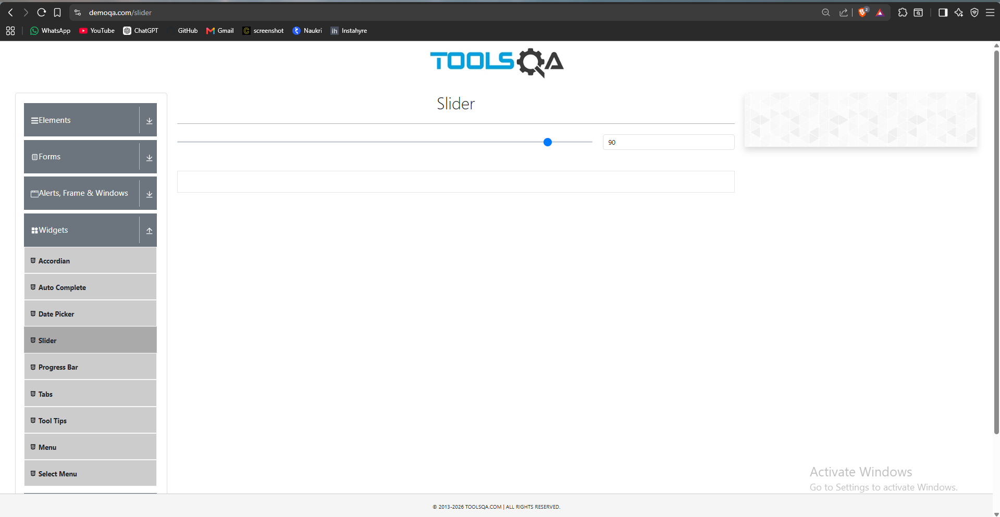
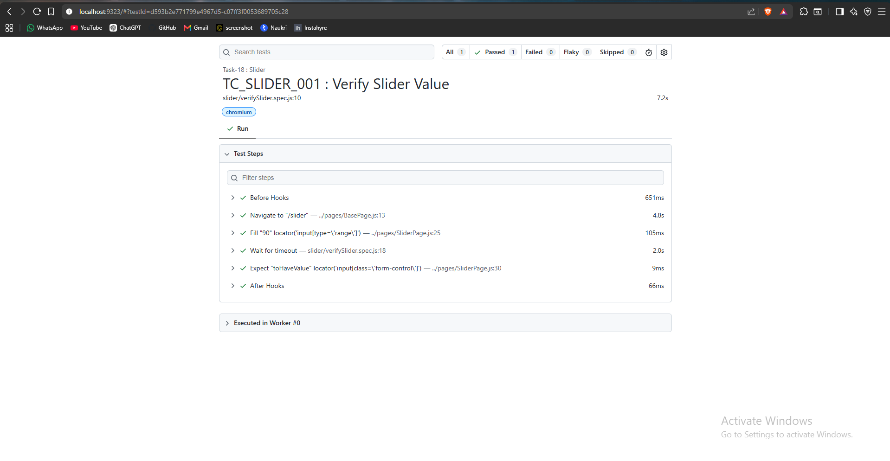

# 🚀 Task-18: Handle Slider Using Playwright

---

# 📖 Project Overview

This task demonstrates how to automate a Slider component using **Playwright with JavaScript**.

The automation script navigates to the DemoQA Slider page, changes the slider value, and verifies that the expected value is displayed.

The framework follows the **Page Object Model (POM)** design pattern with reusable methods from the **BasePage** class.

---

# 🎯 Objective

Verify that the slider value changes successfully after interacting with the slider.

---

# 🌐 Application Under Test

| Property | Value |
|----------|-------|
| Website | DemoQA |
| URL | https://demoqa.com/slider |
| Module | Slider |
| Environment | Demo |

---

# 🛠 Technology Stack

| Technology | Version |
|------------|----------|
| Node.js | v22.11.0 |
| Playwright | v1.61.1 |
| JavaScript (ES6 Modules) | Latest |
| VS Code | IDE |
| Git | Version Control |
| GitHub | Repository Hosting |

---

# 🏗 Framework Design

- Page Object Model (POM)
- BasePage Reusable Methods
- JSON Test Data
- Constants File
- Playwright Assertions
- ES Modules

---

# 📋 Test Case Information

| Field | Details |
|-------|---------|
| Task | Task-18 |
| Module | Slider |
| Scenario | Verify Slider Value |
| Test Type | Functional Testing |
| Execution Type | Automated |
| Priority | High |
| Execution Status | ✅ Passed |

---

# 📁 Project Structure

```text
playwright-practice-js
│
├── docs
│   └── task-18
│       ├── README.md
│       └── screenshots
│
├── pages
│   └── SliderPage.js
│
├── testData
│   └── sliderData.json
│
├── tests
│   └── slider
│       └── verifySlider.spec.js
│
├── utils
│   └── constants.js
│
└── package.json
```

---

# 📌 Test Data

### sliderData.json

```json
{
    "expectedValue": "75"
}
```

---

# 📌 Preconditions

- Node.js installed
- Playwright installed
- Internet connection available

---

# 📝 Test Steps

1. Launch browser.
2. Navigate to the DemoQA Slider page.
3. Move the slider to the desired value.
4. Read the slider value.
5. Verify the displayed value.

---

# ✅ Expected Result

- Slider should move successfully.
- Slider value should match the expected value.

---

# 📌 Postconditions

- Slider value verified successfully.
- Browser closed.

---

# 🔄 BasePage Methods Used

| Method | Purpose |
|---------|---------|
| navigate() | Navigate to application |
| getLocator() | Return locator |
| getInputValue() | Read input value |

---

# 🎯 Playwright Concepts Used

- locator()
- fill() / Keyboard Interaction
- inputValue()
- expect()
- toHaveValue()

---

# ✔ Assertion Used

```javascript
await expect(this.getLocator(this.sliderValue))
    .toHaveValue(expectedValue);
```

---

# ▶ Test Execution

Run all tests

```bash
npx playwright test
```

Run only Slider Test

```bash
npx playwright test tests/slider/verifySlider.spec.js --headed
```

Generate HTML Report

```bash
npx playwright show-report
```

---

# 📸 Screenshots

## Slider Page


---

## Slider Value Updated



---

## Successful Verification


---

## Playwright HTML Report



---

# 🌿 Git Branch

```
feature/task-18-slider
```

---

# ⚠ Challenges Faced

- Understanding slider interaction.
- Verifying dynamic input values.
- Choosing the correct Playwright method for slider automation.

---

# ✅ Solution Implemented

- Automated slider interaction.
- Verified slider value using Playwright assertions.
- Implemented reusable BasePage methods.
- Maintained clean Page Object Model structure.

---

# 📚 Learning Outcome

- Learned Slider automation.
- Learned input value verification.
- Improved reusable framework design.
- Enhanced understanding of Playwright locators and assertions.

---

# 📈 Framework Enhancement

## New Reusable Method

```javascript
async getInputValue(locator)
{
    return await this.page.locator(locator).inputValue();
}
```

### Benefits

Reusable for:

- Slider components
- Text Fields
- Password Fields
- Search Inputs
- Form Validations
- Hidden Inputs

---

# 🚀 Future Enhancements

- Cross Browser Testing
- Jenkins Integration
- GitHub Actions
- Allure Reporting
- Screenshot on Failure
- Parallel Execution

---

# 👨‍💻 Author

**Sohel Shaikh**

QA Automation Engineer

---

# 📄 License

This project is created for learning and portfolio purposes.