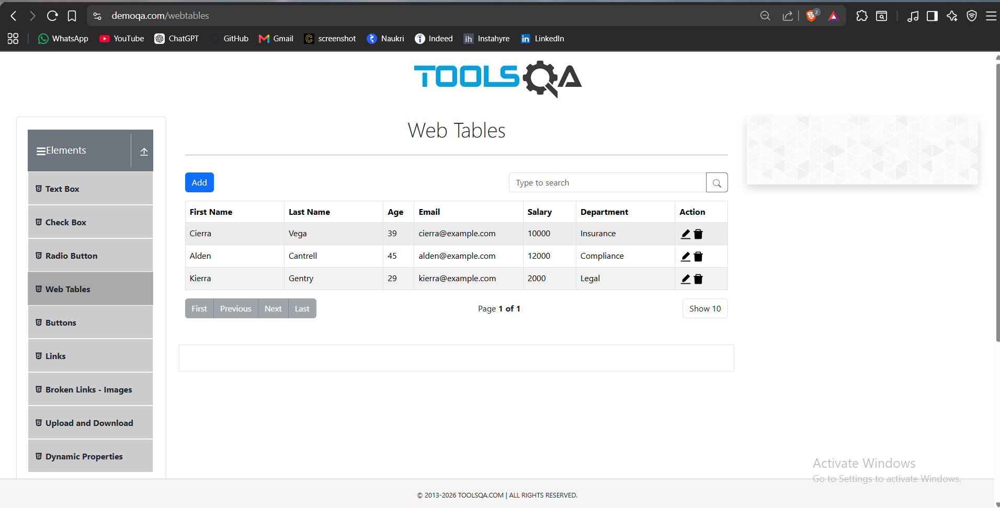
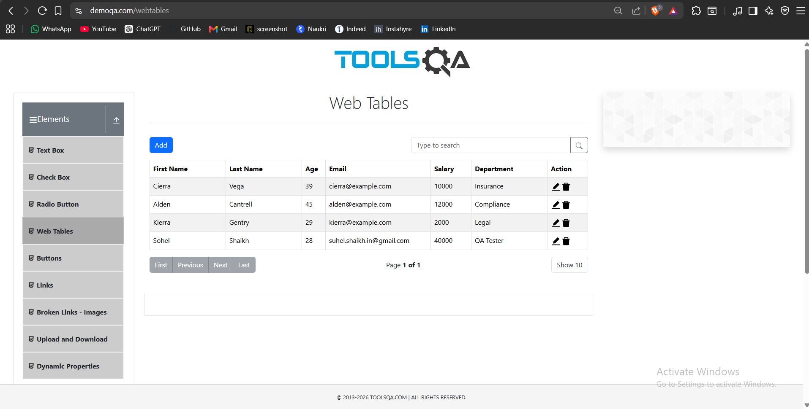
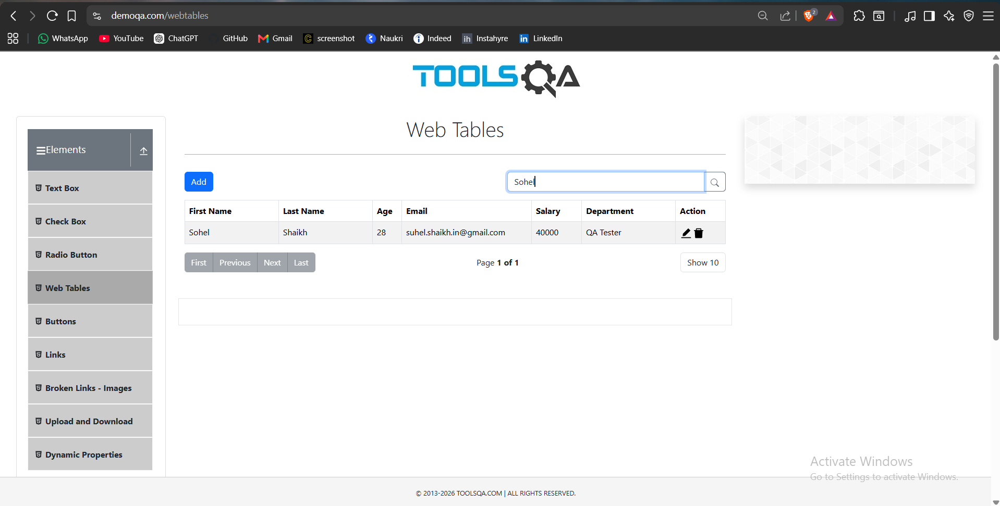
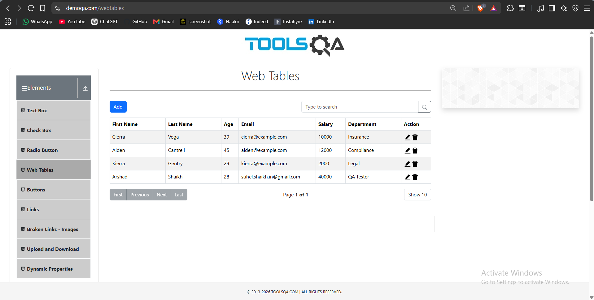
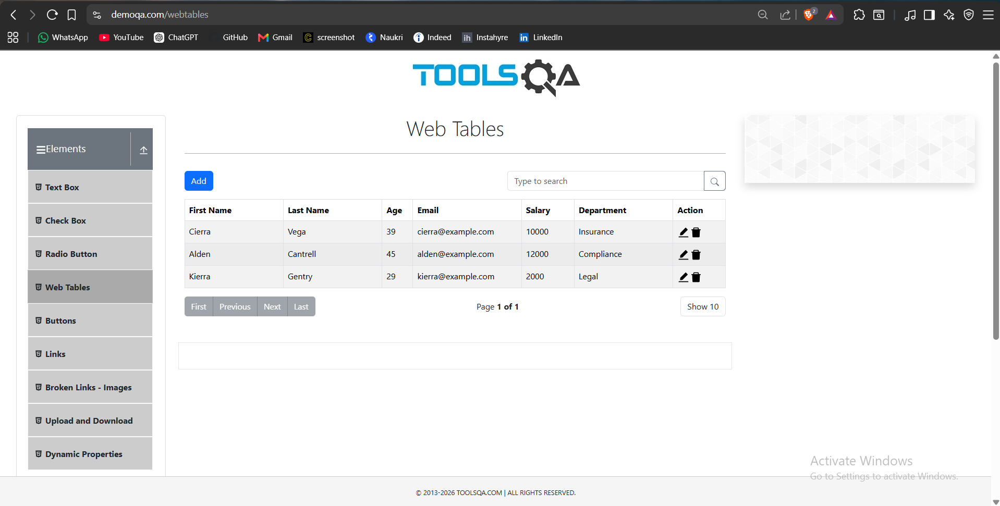
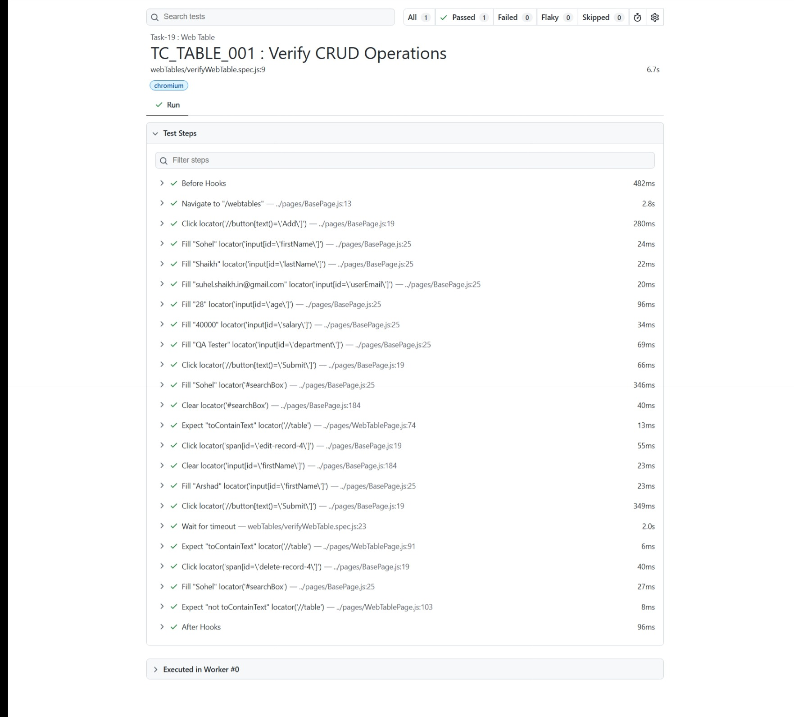

# 🚀 Task-19: Web Table CRUD Operations Using Playwright

---

# 📖 Project Overview

This task demonstrates how to automate **Web Table CRUD (Create, Read, Update, Delete)** operations using **Playwright with JavaScript**.

The automation script performs the complete employee lifecycle by adding a new record, searching for the record, updating employee information, deleting the employee, and verifying each operation.

The project follows the **Page Object Model (POM)** design pattern with reusable methods implemented in the **BasePage** class.

---

# 🎯 Objective

Verify complete CRUD operations on a Web Table.

---

# 🌐 Application Under Test

| Property | Value |
|----------|-------|
| Website | DemoQA |
| URL | https://demoqa.com/webtables |
| Module | Web Tables |
| Environment | Demo |

---

# 🛠 Technology Stack

| Technology | Version |
|------------|----------|
| Node.js | v22.11.0 |
| Playwright | v1.61.1 |
| JavaScript (ES6 Modules) | Latest |
| VS Code | IDE |
| Git | Version Control |
| GitHub | Repository Hosting |

---

# 🏗 Framework Design

- Page Object Model (POM)
- BasePage Reusable Methods
- JSON Test Data
- Constants File
- Playwright Assertions
- ES Modules

---

# 📋 Test Case Information

| Field | Details |
|-------|---------|
| Task | Task-19 |
| Module | Web Tables |
| Scenario | Verify CRUD Operations |
| Test Type | Functional Testing |
| Execution Type | Automated |
| Priority | High |
| Execution Status | ✅ Passed |

---

# 📁 Project Structure

```text
playwright-practice-js
│
├── docs
│   └── task-19
│       ├── README.md
│       └── screenshots
│
├── pages
│   └── WebTablePage.js
│
├── testData
│   └── webTableData.json
│
├── tests
│   └── webTables
│       └── verifyWebTable.spec.js
│
├── utils
│   └── constants.js
│
└── package.json
```

---

# 📌 Test Data

### webTableData.json

```json
{
    "firstName": "Sohel",
    "lastName": "Shaikh",
    "email": "suhel.shaikh.in@gmail.com",
    "age": "28",
    "salary": "40000",
    "department": "QA Tester"
}
```

---

# 📌 Preconditions

- Node.js installed
- Playwright installed
- Internet connection available

---

# 📝 Test Steps

1. Launch browser.
2. Navigate to the Web Tables page.
3. Click **Add**.
4. Enter employee details.
5. Submit the form.
6. Search the employee.
7. Verify employee details.
8. Edit employee salary.
9. Verify updated salary.
10. Delete employee.
11. Verify employee is removed.

---

# ✅ Expected Result

- Employee should be added successfully.
- Employee should be searchable.
- Employee details should update successfully.
- Employee should be deleted successfully.

---

# 📌 Postconditions

- CRUD operations completed successfully.
- Browser closed.

---

# 🔄 BasePage Methods Used

| Method | Purpose |
|---------|---------|
| navigate() | Navigate to application |
| click() | Click element |
| fill() | Enter text |
| clear() | Clear existing value |
| getLocator() | Return locator |
| verifyText() | Verify displayed text |

---

# 🎯 Playwright Concepts Used

- Dynamic Locators
- Web Table Automation
- CRUD Operations
- Playwright Assertions
- JSON Test Data
- Page Object Model (POM)

---

# ✔ Assertions Used

```javascript
await expect(this.getLocator(this.table))
    .toContainText(employeeName);

await expect(this.getLocator(this.table))
    .not.toContainText(employeeName);
```

---

# ▶ Test Execution

Run complete suite

```bash
npx playwright test
```

Run only Task-19

```bash
npx playwright test tests/webTables/verifyWebTable.spec.js --headed
```

Generate HTML Report

```bash
npx playwright show-report
```

---

# 📸 Screenshots

## Web Table Page



---

## Employee Added



---

## Employee Search



---

## Employee Updated



---

## Employee Deleted



---

## Playwright HTML Report



---

# 🌿 Git Branch

```
feature/task-19-web-table-crud
```

---

# ⚠ Challenges Faced

- Handling dynamic table rows.
- Searching records before verification.
- Updating existing records.
- Deleting records and validating removal.

---

# ✅ Solution Implemented

- Automated complete CRUD operations.
- Used reusable BasePage methods.
- Followed Page Object Model.
- Used Playwright assertions for validation.

---

# 📚 Learning Outcome

- Learned Web Table automation.
- Performed CRUD operations.
- Improved dynamic locator handling.
- Enhanced reusable framework design.

---

# 📈 Framework Enhancement

## New Reusable Methods

```javascript
async clear(locator)
{
    await this.page.locator(locator).clear();
}

async press(locator, key)
{
    await this.page.locator(locator).press(key);
}

async getText(locator)
{
    return await this.page.locator(locator).textContent();
}

async count(locator)
{
    return await this.page.locator(locator).count();
}

async isVisible(locator)
{
    return await this.page.locator(locator).isVisible();
}
```

### Benefits

Reusable for:

- Web Tables
- Search Results
- Dynamic Lists
- Pagination
- Forms
- Data Validation

---

# 🚀 Future Enhancements

- Dynamic row identification
- Pagination handling
- Sorting verification
- Filtering validation
- Cross-browser execution
- Jenkins CI/CD
- GitHub Actions
- Allure Reporting

---

# 👨‍💻 Author

**Sohel Shaikh**

QA Automation Engineer

---

# 📄 License

This project is created for learning and portfolio purposes.